# Технический отчет: Низкоуровневая реализация контейнеризации в Linux

## 1. Чему мы научились (Глубокий разбор технологий)

В рамках данной работы была проведена деконструкция архитектуры современных контейнеров (Docker/Podman). Мы изучили, как ядро Linux объединяет независимые подсистемы для создания изолированной среды исполнения.

* **Механика Namespaces (Пространства имен):** Мы реализовали изоляцию ресурсов на уровне системных вызовов. 
    * **PID Namespace:** С помощью `unshare --fork --pid` мы создали изолированное дерево процессов. Внутри этого пространства процесс получил **PID 1**, что делает его «инициатором» (init) для своего окружения. Это критически важно, так как такой процесс не может «видеть» или посылать сигналы процессам хоста, обеспечивая безопасность.
    * **Network Namespace:** Мы протестировали создание изолированного сетевого стека. Процесс внутри него оказывается в «сетевом вакууме», имея доступ только к петлевому интерфейсу (lo). Это исключает возможность сетевых атак из контейнера на сервисы хоста.

* **Управление ресурсами через Cgroups (Control Groups) v2:** Мы освоили механизм квотирования ресурсов. Работа с файловой системой `/sys/fs/cgroup` позволила нам напрямую взаимодействовать с планировщиком задач ядра (**CFS Scheduler**). Установка лимита `cpu.max` (например, 20% от кванта времени) гарантирует, что даже при стопроцентной нагрузке внутри контейнера, остальная система сохранит отзывчивость. Это принципиальное отличие контейнера от обычного процесса: контейнер имеет «потолок» потребления, который он не может пробить.

* **Изоляция файловой системы (Chroot & RootFS):**
    Мы научились создавать минимальный **RootFS** (корневую файловую систему). С помощью `chroot` (change root) мы переопределили корневую директорию для процесса. Это базовая мера безопасности: процесс оказывается заперт в «песочнице», не имея доступа к критическим файлам хоста (паролям, ключам, логам), так как путь `/` для него теперь ограничен нашей директорией.

---

## 2. Возникшие проблемы и их инженерные решения

В процессе работы возник ряд нетривиальных проблем, связанных со спецификой ядра и системных библиотек:

1.  **Ошибка `kill: not enough arguments` при снятии нагрузки:**
    * **Причина:** При попытке остановить `stress-ng` команда `kill $(cat cgroup.procs)` завершалась с ошибкой. Это происходило потому, что процесс уже завершился по таймауту, файл `cgroup.procs` стал пустым, и команда `kill` вызывалась без аргумента (PID).
    * **Решение:** Мы применили конструкцию с **`xargs -r`** (или `--no-run-if-empty`). Это предотвращает запуск команды `kill`, если входной поток пуст, что делает скрипты автоматизации более отказоустойчивыми.

2.  **Зависимости библиотек и «призрачная» библиотека `linux-vdso.so.1`:**
    * **Причина:** При настройке `chroot` стандартные утилиты (`ls`, `bash`) падали с ошибками сегментирования или нехватки библиотек (например, `libselinux.so.1` для `ls` и `libtinfo.so.6` для `bash`). Особую сложность вызвала `linux-vdso.so.1`, которую невозможно найти на диске.
    * **Решение:** Выяснилось, что **vDSO** — это виртуальная библиотека, которую ядро само маппит в память процесса для ускорения системных вызовов, её не нужно копировать. Для остальных реальных зависимостей мы внедрили автоматизацию: цикл `for` в связке с утилитами `ldd` и `awk` позволил нам динамически вычислять пути ко всем библиотекам и копировать их в `rootfs` с сохранением иерархии.

3.  **Специфика РЕД ОС (SELinux-зависимости):**
    * **Причина:** В данной ОС утилиты имеют жесткую связь с библиотеками безопасности, что усложнило ручную сборку окружения.
    * **Решение:** Полное копирование цепочки зависимостей, выявленных через `ldd`, обеспечило работоспособность команд внутри `chroot` без отключения механизмов защиты хоста.

---

## 3. Ответы на контрольные вопросы (Экспертный уровень)

### Чем namespace отличается от cgroup?
Это два фундаментально разных вектора контроля:
* **Namespaces ограничивают ВИДИМОСТЬ.** Это логическая изоляция. Процесс «думает», что он один в системе, видит только свой PID=1, свои точки монтирования и свою сеть. Он не знает о существовании других «соседей».
* **Cgroups ограничивают ПОТРЕБЛЕНИЕ.** Это физическая изоляция. Механизм накладывает жесткие лимиты на использование CPU (процессорные такты), RAM (объем памяти), Disk I/O (скорость чтения/записи). 
* **Итог:** Namespace не дает процессу «увидеть» лишнее, а Cgroup не дает ему «съесть» лишнее.

### Почему после exit процессы хоста остались нетронутыми?
Когда мы используем `unshare`, ядро Linux создает для нового процесса собственные структуры данных (namespaces). Это своего рода «проекция» реальности. Команда `exit` завершает основной процесс (shell) внутри этого изолированного «пузыря». Поскольку у этого процесса не было физического доступа к таблице процессов хоста (благодаря PID namespace), он не мог послать им сигналы завершения. После выхода «пузырь» просто уничтожается ядром, не затрагивая стабильность родительской системы.

### Что произойдет, если превысить лимит памяти в cgroup?
Ядро Linux задействует механизм **OOM-killer (Out-Of-Memory Killer)**. 
Каждая контрольная группа имеет свой счетчик лимитов. Как только потребление внутри группы достигает порога `memory.max`, ядро анализирует процессы внутри этой конкретной группы и принудительно завершает (убивает) процесс-нарушитель (сигнал SIGKILL). Это критически важный механизм самозащиты ОС: ядро жертвует одним «прожорливым» процессом внутри контейнера, чтобы предотвратить Kernel Panic или зависание всего физического сервера. 

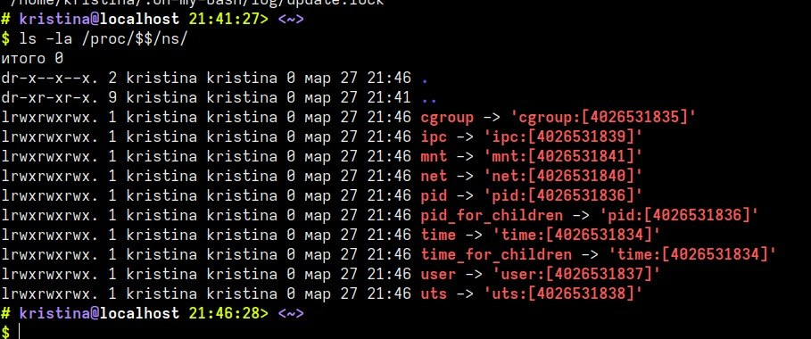

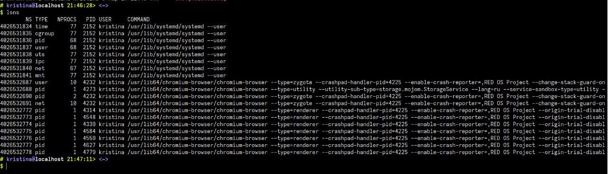

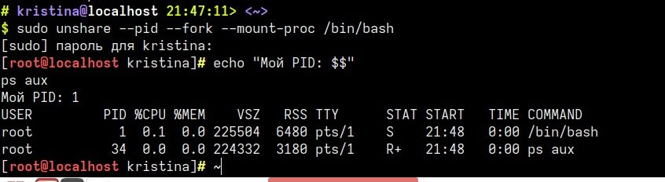

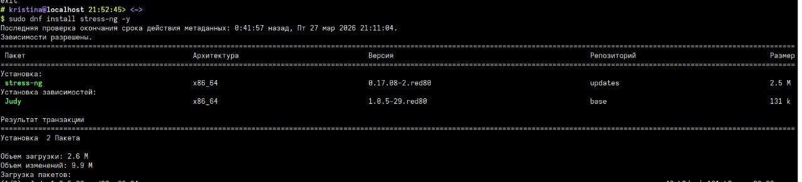

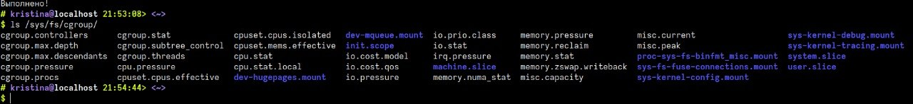

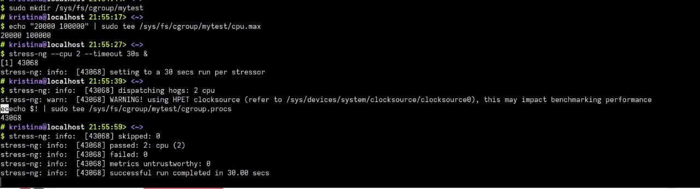

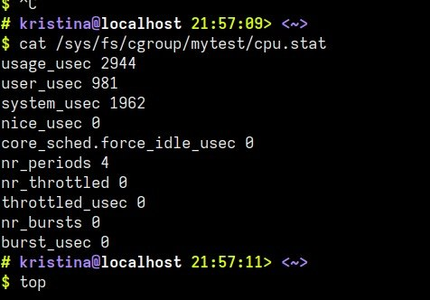

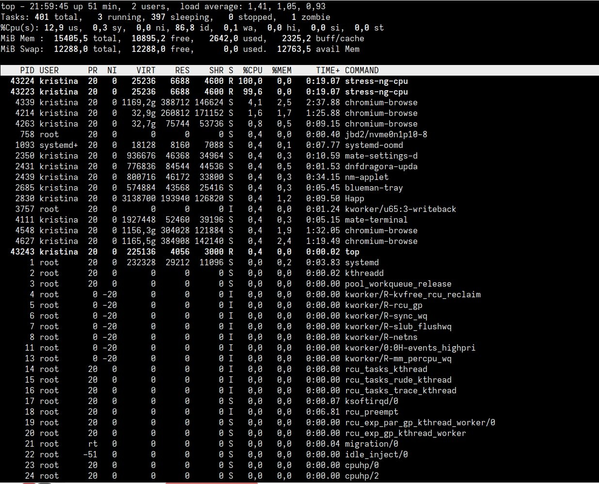

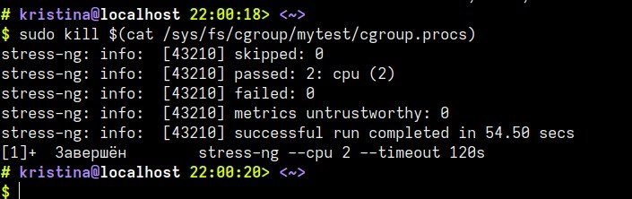

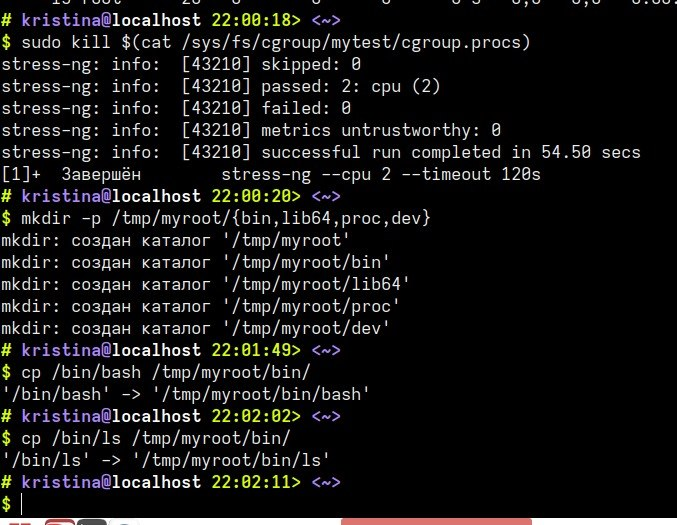

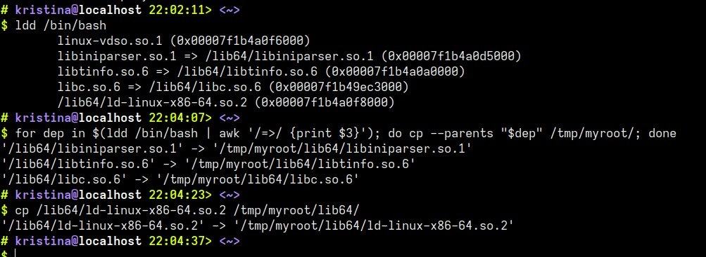

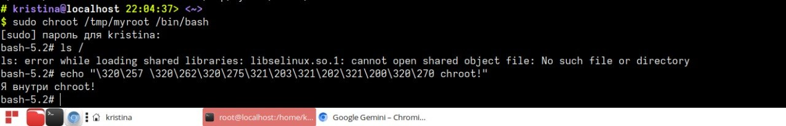