## 1. Чему я научилась 
В ходе этой лабораторной работы я освоила развёртывание кластера Kubernetes с помощью k3s и научилась управлять его базовыми объектами. Теперь я понимаю, как проверять состояние нод и системных компонентов через kubectl get nodes и kubectl get pods -n kube-system. Я научилась запускать поды двумя способами: быстрым (через kubectl run) и правильным а именно через YAML-манифесты с описанием ресурсов и лимитов. Также я разобралась, как заглядывать внутрь запущенного контейнера, проверять его переменные окружения, сетевые настройки и логи\

## 2. Проблемы и как я их решила 
При установке k3s на Red OS я столкнулась с парой серьёзных затыков. Сначала возникли ошибки из-за политик безопасности SELinux, поэтому мне пришлось использовать флаг INSTALL_K3S_SKIP_SELINUX_RPM=true при запуске скрипта установки. Затем я обнаружила в логах ошибку «пустого ответа» (EOF), когда API-сервер не мог достучаться до Kubelet по адресу 172.20.10.2. Как оказалось, встроенный Firewall в Red OS блокировал трафик, даже если порт казался открытым. 

## 3. Контрольные вопросы

в пространстве имен kube-system всегда должны быть в статусе Running такие поды, как kube-apiserver (главный узел управления), etcd (хранилище данных), kube-scheduler, kube-controller-manager, а также сетевой плагин и coredns. Главное отличие Pod от Container заключается в том, что контейнер — это одиночный изолированный процесс, а Pod — это минимальная единица в Kubernetes, которая может объединять несколько контейнеров с общим IP и томами данных. 
Когда я убила основной процесс nginx командой kill 1, мой Pod не удалился, а просто перезапустился. Это произошло потому, что за жизнеспособность контейнеров на конкретной ноде отвечает Kubelet — он увидел падение процесса и автоматически поднял новый контейнер согласно политике перезапуска.

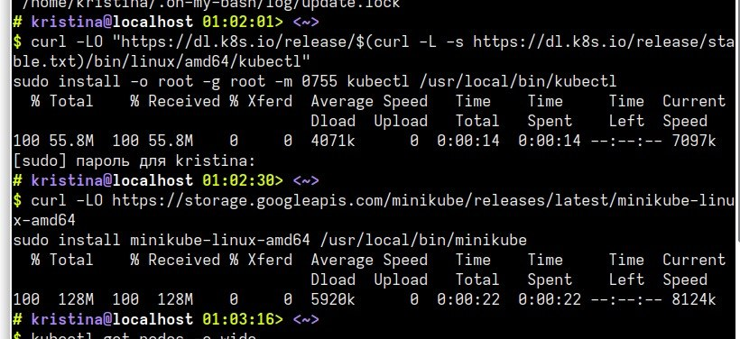

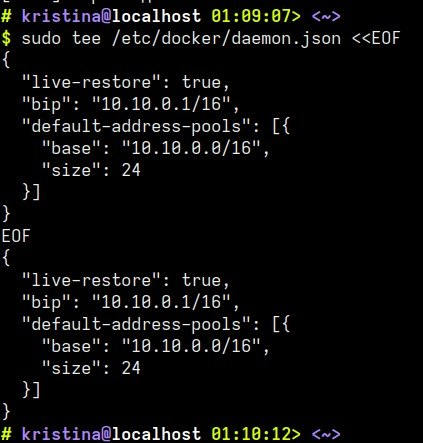

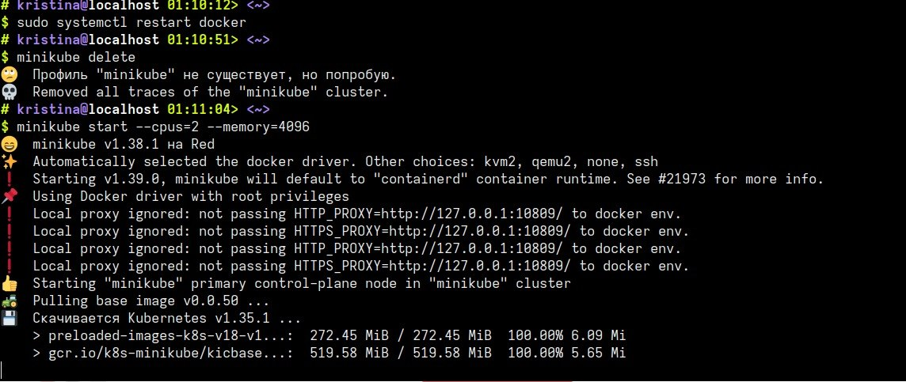

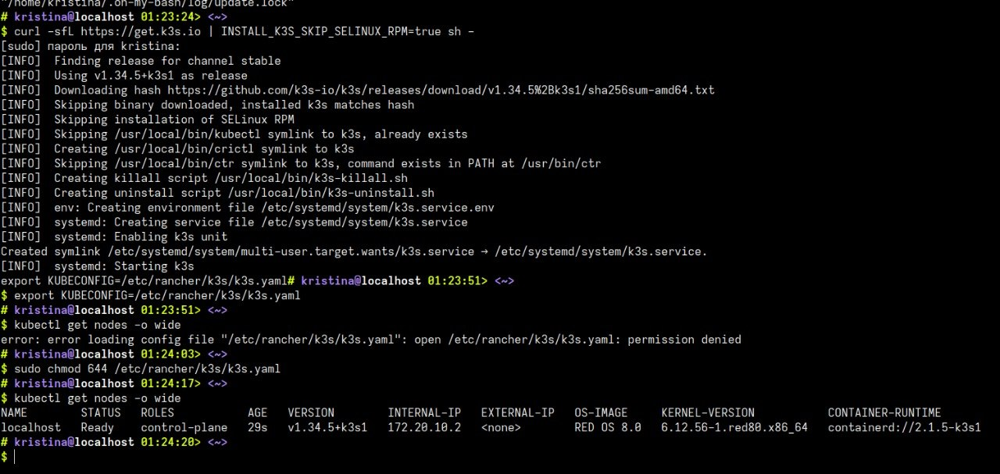

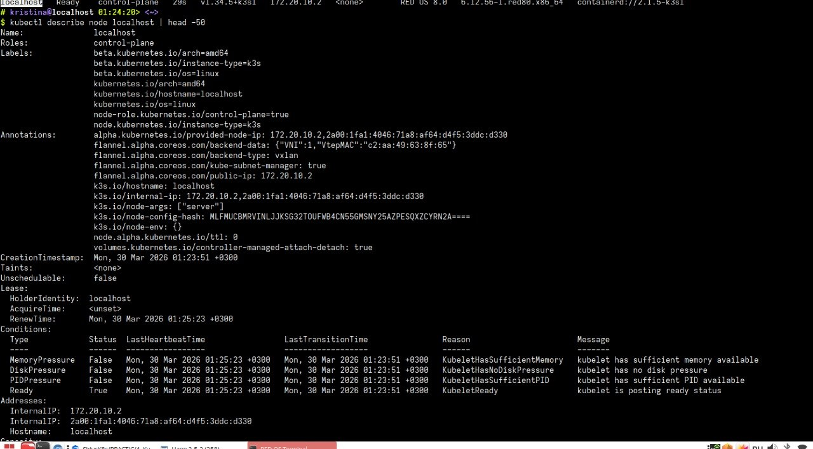

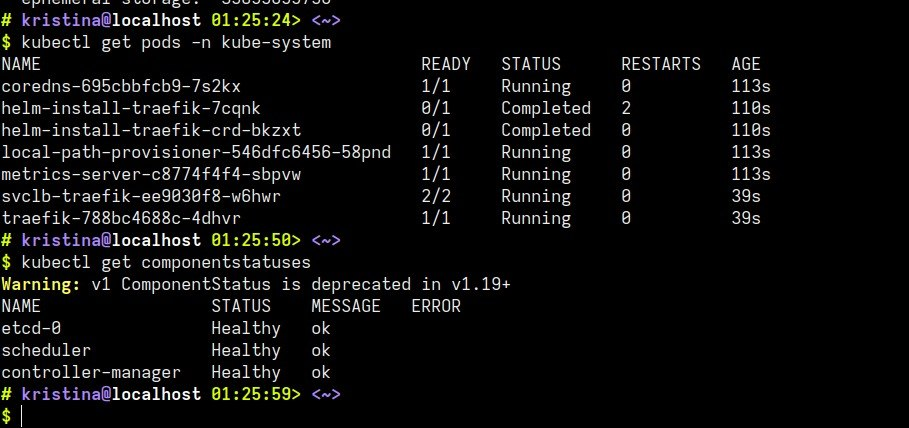

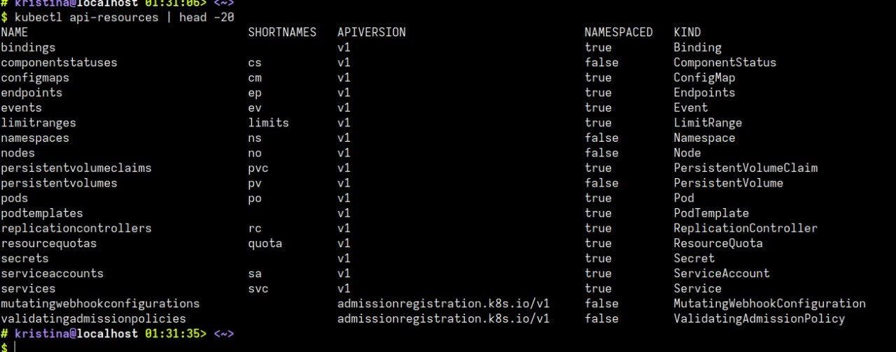

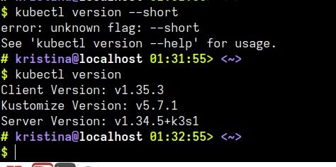

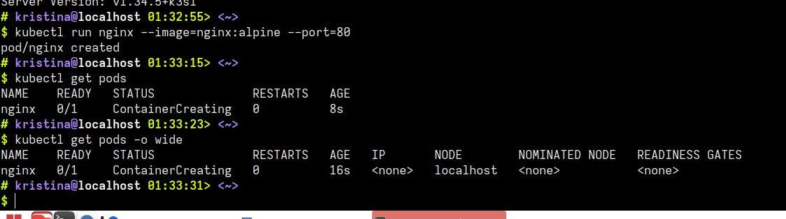

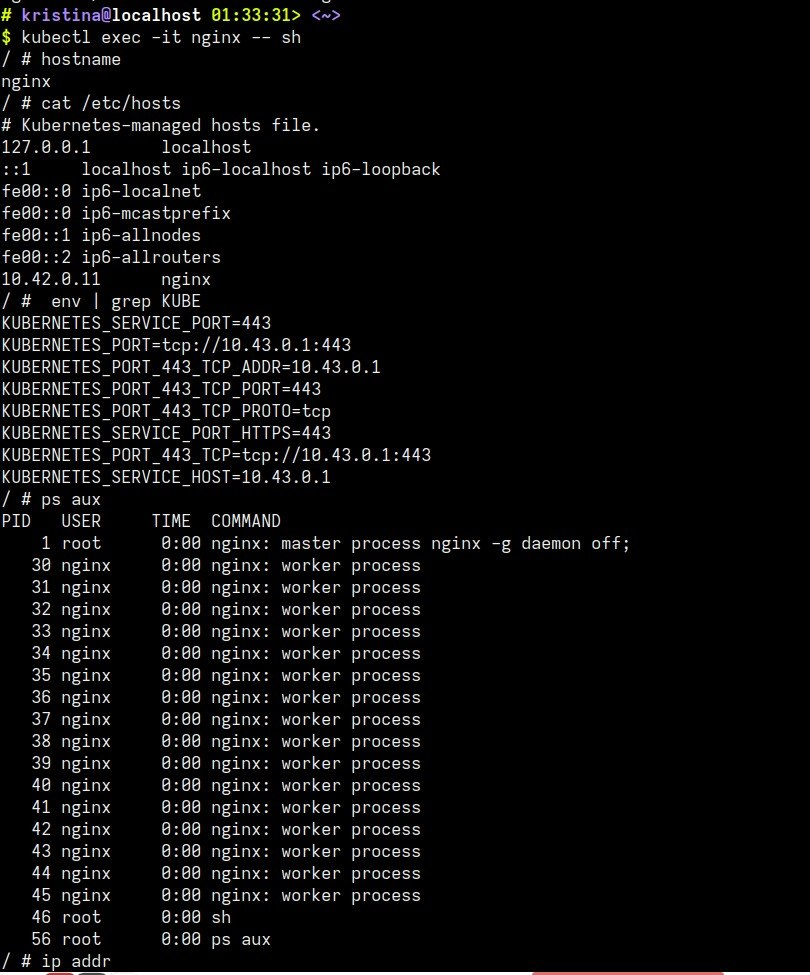

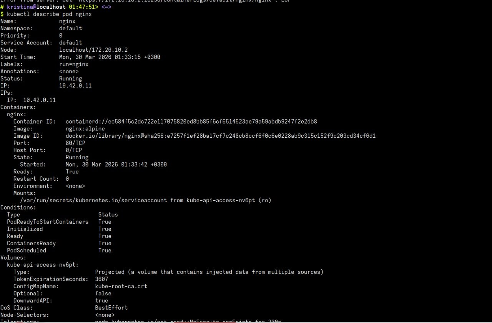

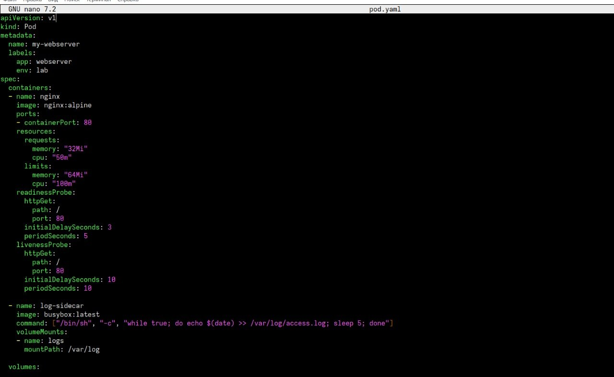

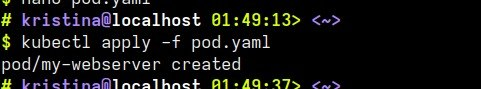

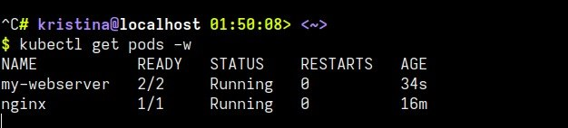

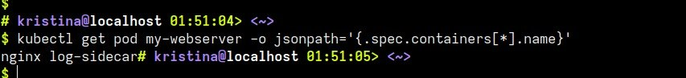

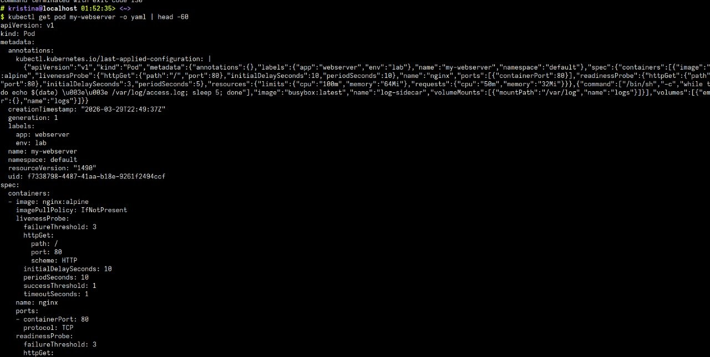

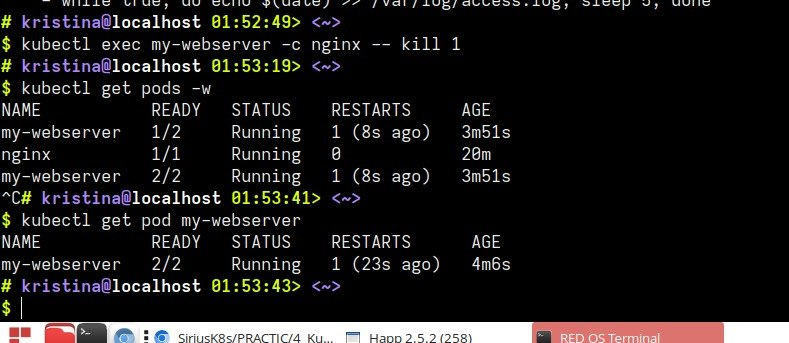
