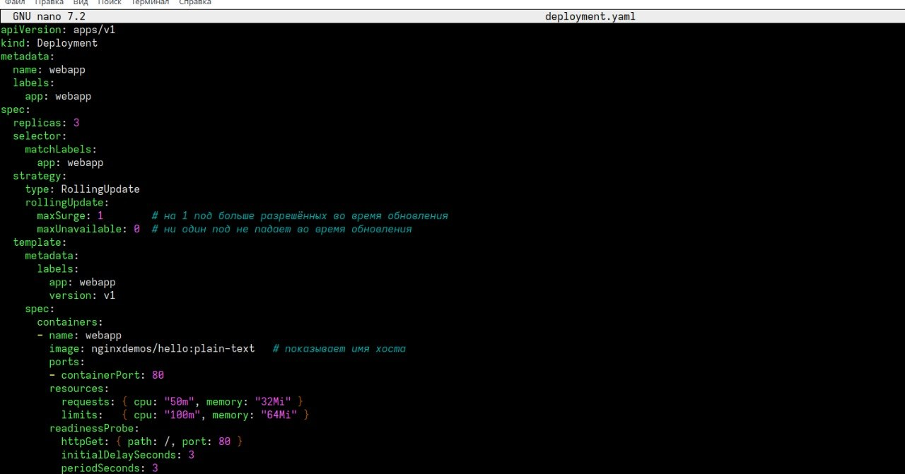
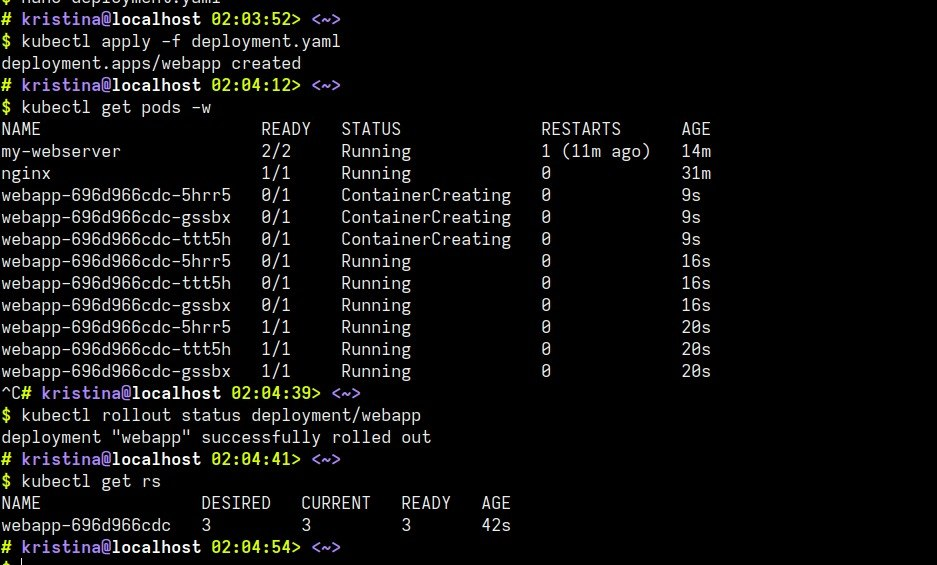
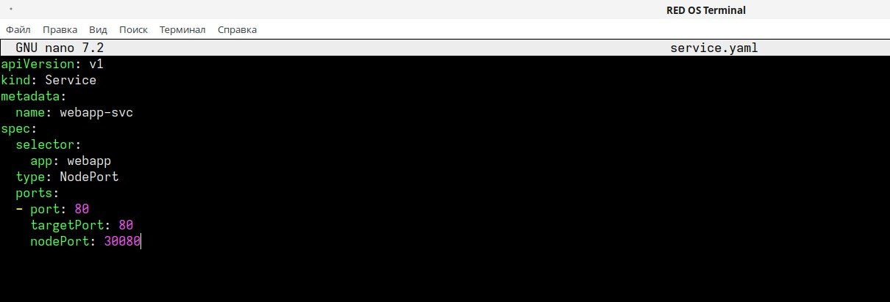
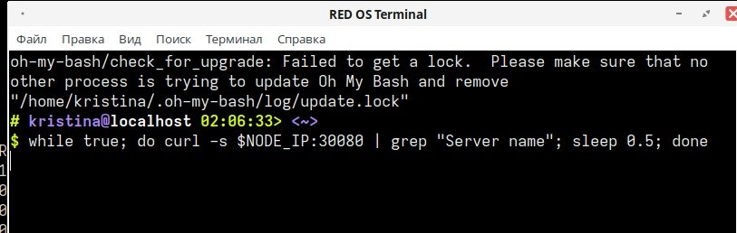
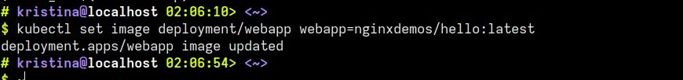
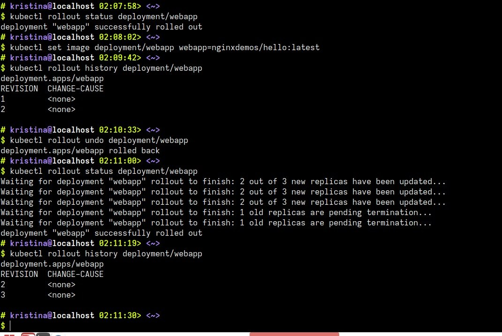
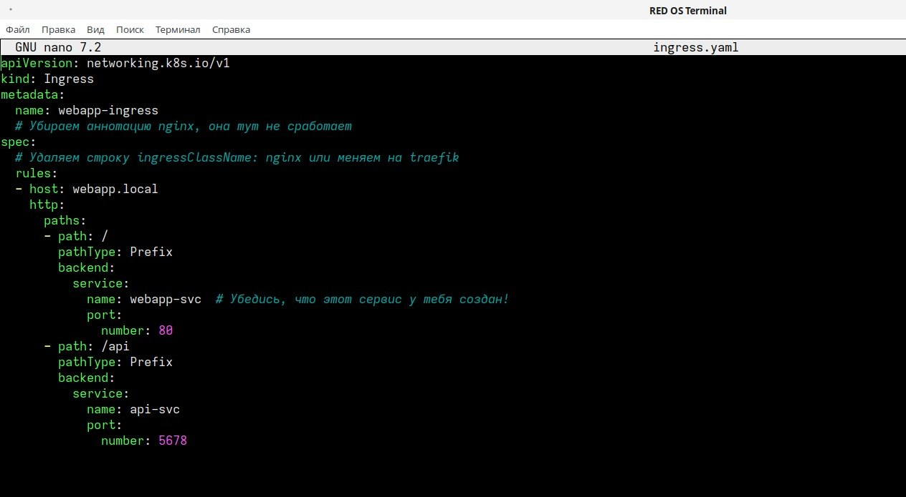
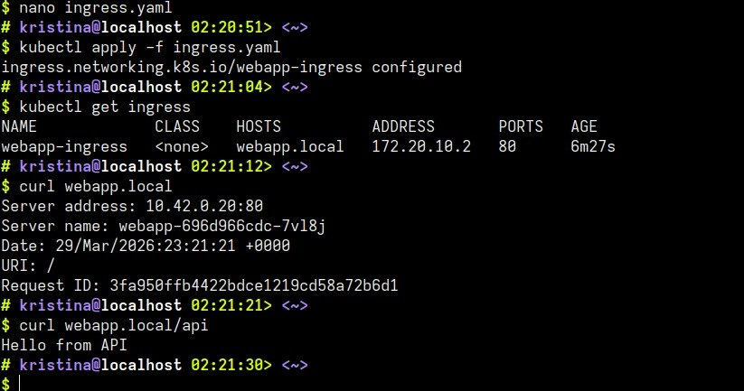
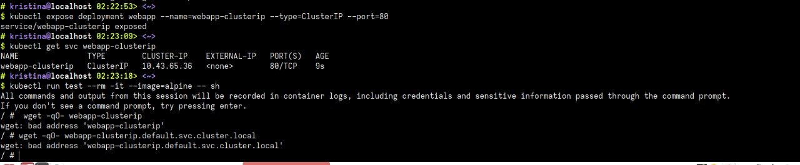
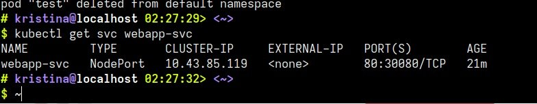

## 1. Чему я научилась
* я научилась настраивать Rolling Update, что позволяет обновлять приложение постепенно, заменяя старые контейнеры новыми без остановки всего сайта. Это гарантирует доступность сервиса для пользователей даже во время технических работ. Если в новой версии обнаруживаются ошибки, я освоила механизм Rollback, который позволяет мгновенно вернуть предыдущую рабочую версию из сохраненной истории деплоймента. Также я научилась использовать Ingress для создания понятных доменных имен, например webapp.local. Это позволило заменить обращение по сложным IP-адресам и портам на удобную маршрутизацию, которая автоматически направляет запросы к нужным частям приложения.
## 2.  Проблемы и как я их решила
В процессе выполнения лабораторной работы я столкнулась с несколькими техническими барьерами, которые потребовали корректировки настроек под конкретную среду k3s. Сначала возникло недопонимание с версиями деплоймента: после отката изменений (rollout undo) вместо возврата к первой ревизии в списке появилась третья. Как оказалось, Kubernetes не удаляет историю, а просто создает новую версию на базе настроек старой, чтобы сохранить всю цепочку действий. Затем возникла ошибка при попытке узнать IP-адрес кластера через команду minikube ip, которая не предназначена для k3s; проблему я решила, используя локальный адрес 127.0.0.1, так как кластер работает непосредственно на моей машине. Основная сложность возникла с Ingress-контроллером: правила маршрутизации игнорировались, потому что в конфигурации был указан класс nginx, в то время как в k3s по умолчанию работает traefik. После удаления привязки к конкретному классу контроллер увидел ресурс и начал перенаправлять трафик. В завершение я столкнулась с ошибкой «bad address» при тестировании внутренней сети из контейнера Alpine. Это произошло из-за задержки обновления записей в CoreDNS и особенностей работы резолвера в этом образе. Проблема могла бы быть устранена использованием полного доменного имени (FQDN) и небольшим ожиданием синхронизации DNS-записей внутри кластера, но что то не сложилось…

## 3. Контрольные вопросы
Разница между типами сервисов заключается в способе доступа к приложению: ClusterIP создает внутренний IP-адрес, который виден только другим программам внутри самого кластера, тогда как NodePort открывает конкретный порт на физическом адресе сервера, позволяя зайти на сайт снаружи по IP-адресу машины. LoadBalancer автоматически запрашивает у облачного провайдера полноценный внешний адрес, хотя в локальных системах вроде k3s он обычно работает по упрощенной схеме NodePort.
Что касается стратегий обновления, RollingUpdate заменяет старые части приложения новыми по очереди, что позволяет сайту работать без перерывов, в то время как стратегия Recreate сначала полностью удаляет старую версию и только потом запускает новую, из-за чего возникает временная остановка в работе сервиса.
Использование Ingress вместо NodePort оправдано тем, что NodePort требует выделять отдельный сложный порт (вроде 30080) для каждой программы, что неудобно и небезопасно. Ingress же выступает единой точкой входа на стандартных портах и умеет сам распределять входящий трафик по доменным именам (например, webapp.local) или путям в адресе (например, /api), позволяя обслуживать множество разных сервисов через одно окно

