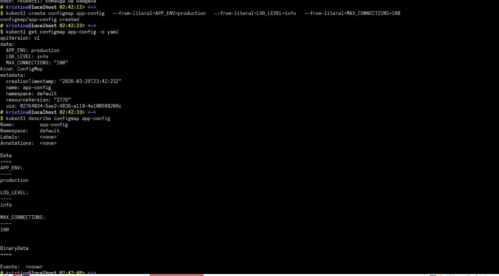
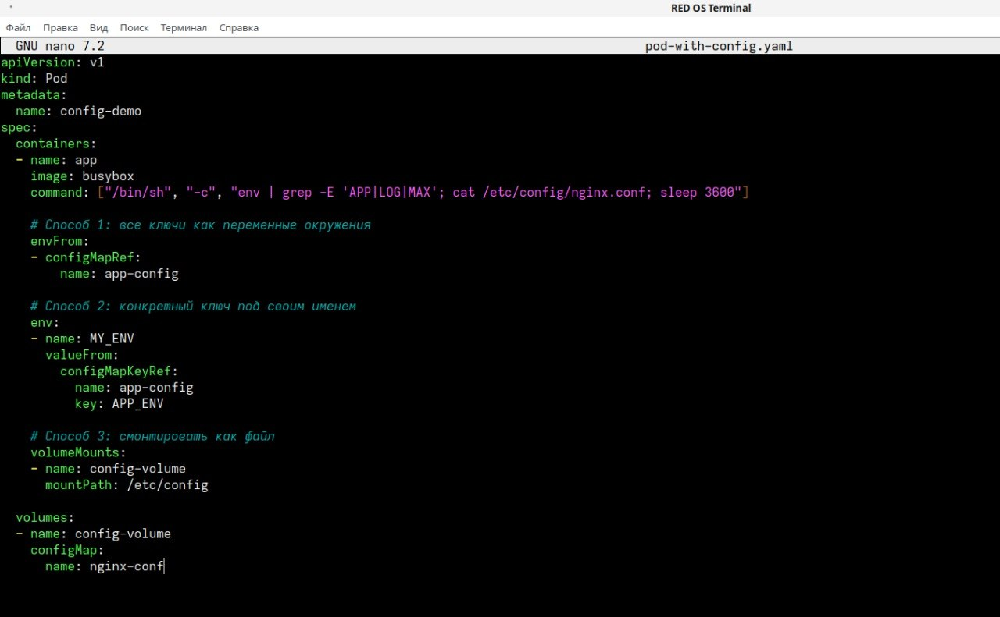
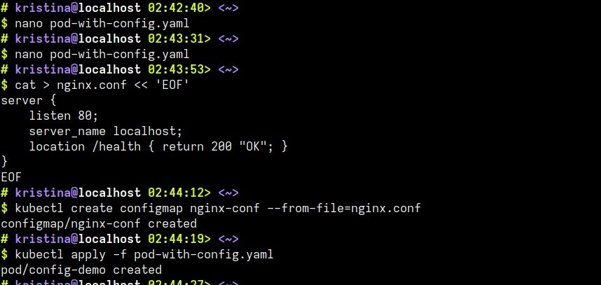
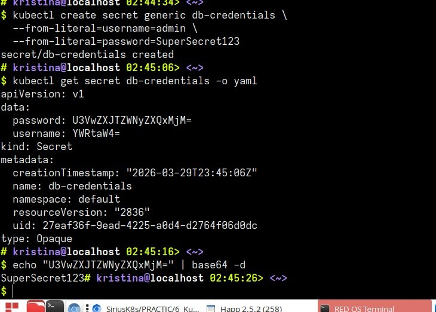
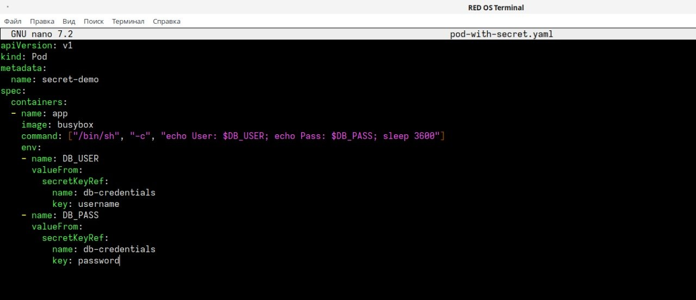
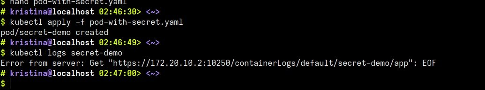
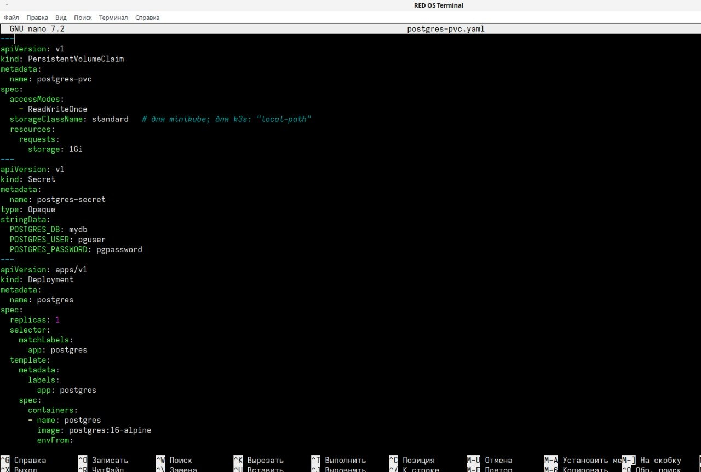
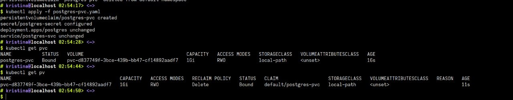
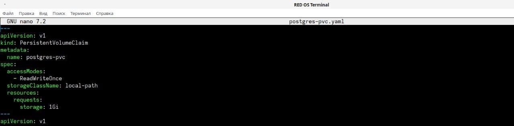
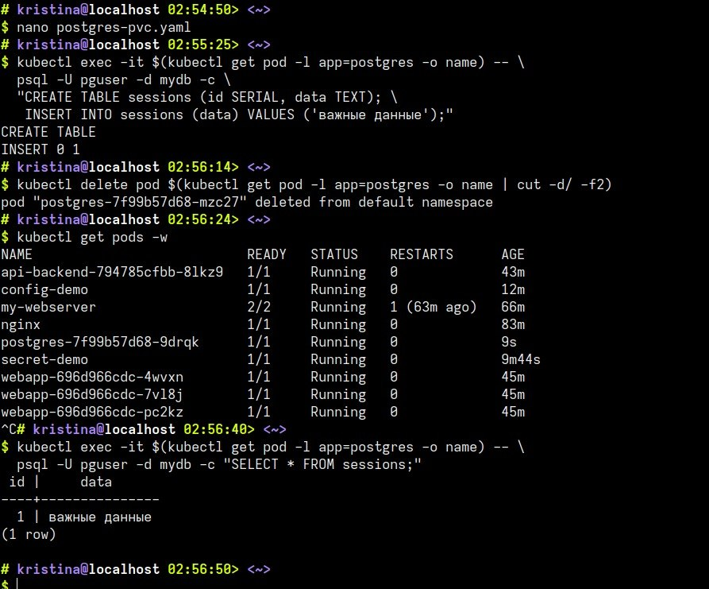

## 1. Чему я научилась
Я научилась отделять настройки и пароли от самого кода. Теперь я умею передавать конфигурацию через ConfigMap (как переменные и как файлы) и хранить пароли в Secret. Главное  я настроила базу данных PostgreSQL с постоянным хранилищем (PVC). Теперь, даже если удалить под с базой, все данные (таблицы и записи) сохраняются на диске и автоматически подцепляются новым подом.

## 2. Проблемы и их решения
При настройке базы данных я указала класс хранилища storageClassName: standard. Этот параметр подходит для Minikube, но в моем кластере k3s используется local-path. Из-за этого запрос на диск завис в статусе Pending, и база не запускалась.
Поскольку настройки диска (spec) в Kubernetes нельзя просто отредактировать «на лету» (они неизменяемы), обычный kubectl apply выдавал ошибку. Решение: Я полностью удалила старый запрос командой kubectl delete pvc postgres-pvc, исправила в файле класс на local-path и создала его заново. После этого диск перешел в статус Bound, и данные стали сохраняться.

## 3. Контрольные вопросы
#### Почему нельзя хранить конфиги внутри образа? 
    Потому что тогда для изменения одной настройки (например, уровня логирования) придется заново пересобирать весь образ. С ConfigMap можно менять параметры без пересборки кода.

#### Почему Secret в K8s небезопасен по умолчанию? 
    Потому что данные в нем просто закодированы в base64, что легко читается любым человеком. Для реальной защиты нужно включать шифрование в самом кластере или использовать внешние хранилища (типа Vault).

#### Почему данные в PostgreSQL не удалились вместе с подом?
    Потому что они хранились не внутри контейнера, а на отдельном томе (Persistent Volume). Когда под удаляется, диск остается «жить» в кластере, и новый под просто подключается к нему обратно.

#### Зачем нужен envFrom?
    Чтобы не прописывать каждую переменную вручную. Эта команда загружает сразу все ключи из ConfigMap или Secret в виде переменных окружения одной строкой.

