## 1. Чему я научилась
Я научилась настраивать систему безопасности кластера по принципу минимальных привилегий. Теперь я умею создавать ServiceAccount и ограничивать права приложений через RBAC (например, разрешать только чтение списка подов). Я освоила изоляцию трафика с помощью NetworkPolicy, чтобы базы данных были доступны только нужным сервисам, а не всему кластеру. Также я научилась самостоятельно выпускать SSL-сертификаты (создавать свой CA), подписывать их и настраивать защищенное HTTPS-соединение для Ingress.

## 2. Проблемы и их решения
    • Блокировка DNS при настройке NetworkPolicy: После применения политики default-deny-ingress команда wget начала выдавать ошибку bad address. Причина: Политика заблокировала доступ к DNS-серверу кластера (порт 53). Под перестал понимать, какой IP-адрес соответствует имени сервиса. Решение: Для проверки правил я использовала прямое обращение по ClusterIP (например, 10.43.187.204). Это позволило подтвердить, что трафик между подами фильтруется правильно: связь с бэкендом работает, а к базе данных доступ закрыт.
    • Ошибка TLS и «чужой» сертификат: При проверке HTTPS-соединения curl выдавал ошибку, а openssl показывал стандартный сертификат Traefik вместо моего. Причина: В манифесте Ingress был указан класс nginx, который мой кластер k3s игнорировал. В итоге контроллер Traefik не подгружал мой секрет с сертификатом. Также команда minikube ip не работала, так как среда выполнения — k3s. Решение: Я изменила ingressClassName на traefik и вручную прописала адрес 127.0.0.1 webapp.local в файл /etc/hosts. После этого сертификат успешно применился и проверка выдала Verify return code: 0 (ok).

## 3. Контрольные вопросы
#### В чем разница между Role и ClusterRole? 
Role дает права только внутри одного конкретного пространства имен (Namespace). ClusterRole работает на уровне всего кластера (например, дает право смотреть узлы или поды во всех проектах сразу).
#### Зачем нужен ServiceAccount?
Это «учетная запись» для программ, а не для людей. Мы привязываем её к поду, чтобы приложение могло само обращаться к API Kubernetes (например, читать логи или список других подов) с четко ограниченными правами.
#### Как работает NetworkPolicy, если правил несколько?
Если в пространстве имен включены политики, то разрешено только то, что явно прописано в правилах allow. Всё остальное блокируется по умолчанию. Правила дополняют друг друга.
#### Безопасно ли хранить сертификаты в Secret?
В базовом виде — нет, так как данные там просто закодированы в base64. Для реальной защиты нужно настраивать шифрование хранилища (etcd) или подключать внешние системы управления ключами.
#### Что проверяет параметр Verify return code: 0 (ok) в openssl?
Он подтверждает, что цепочка доверия верна: сертификат сайта действительно подписан тем центром сертификации (CA), которому мы доверяем (нашим файлом ca.crt), и срок его действия не истек.

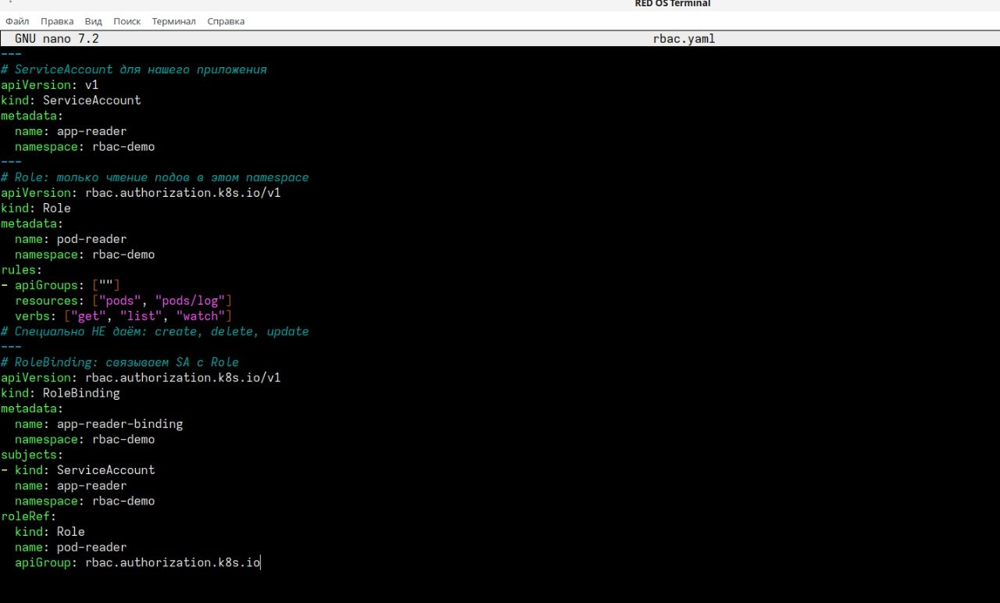

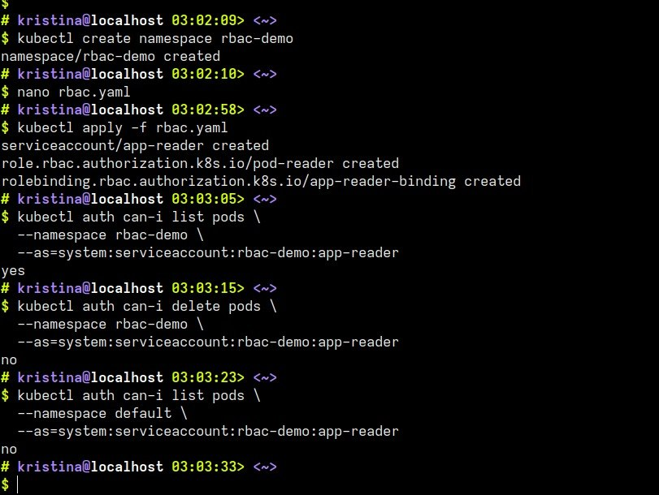

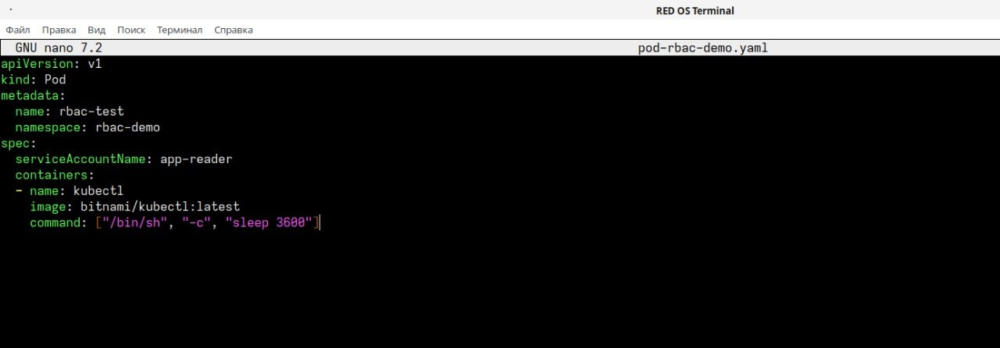

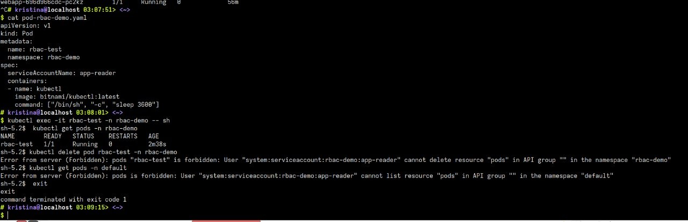

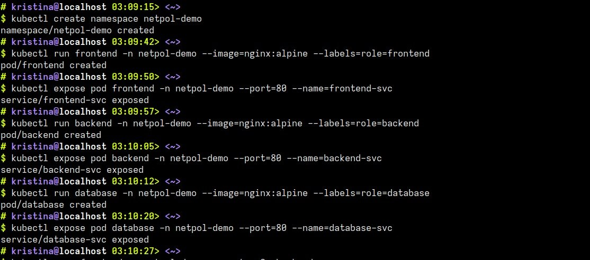

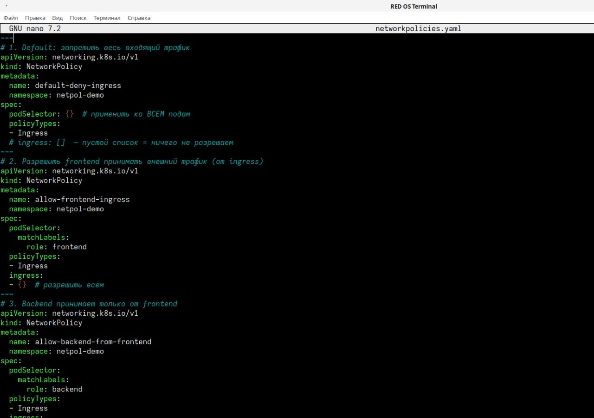

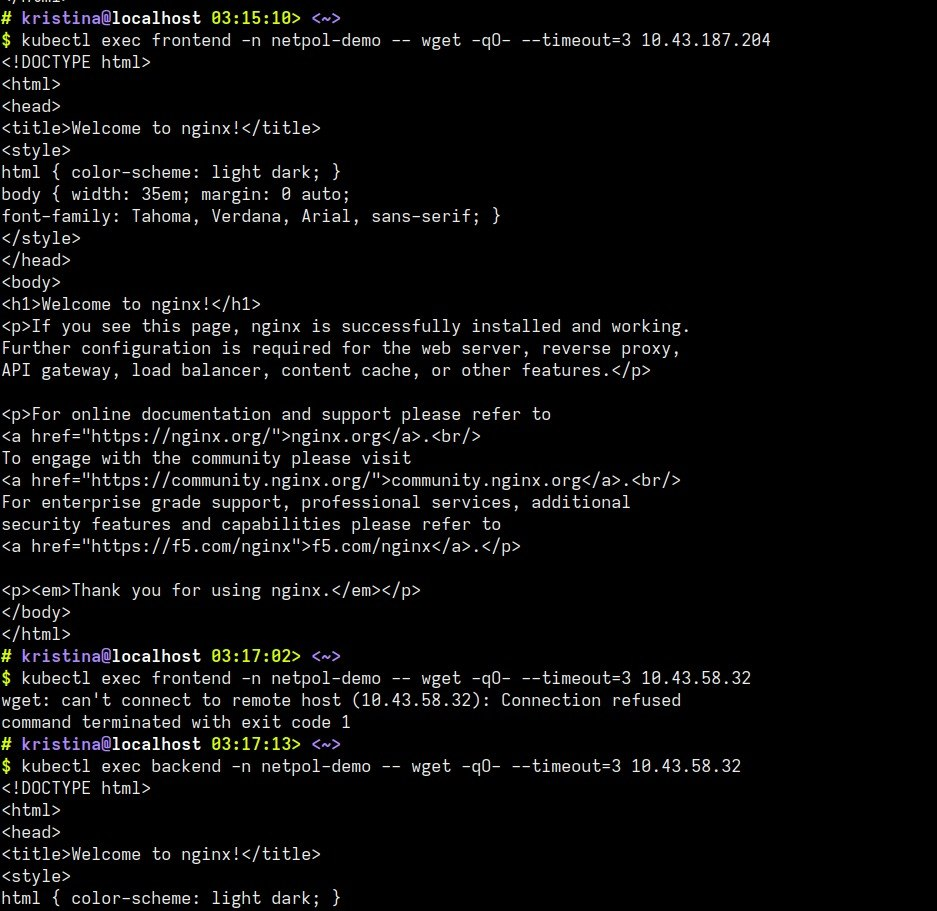

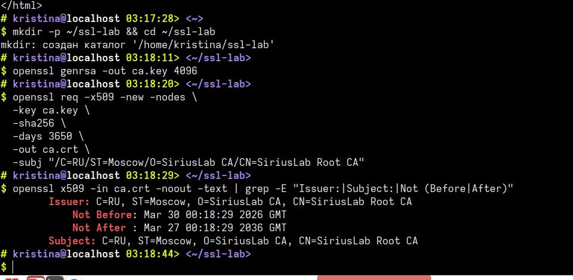

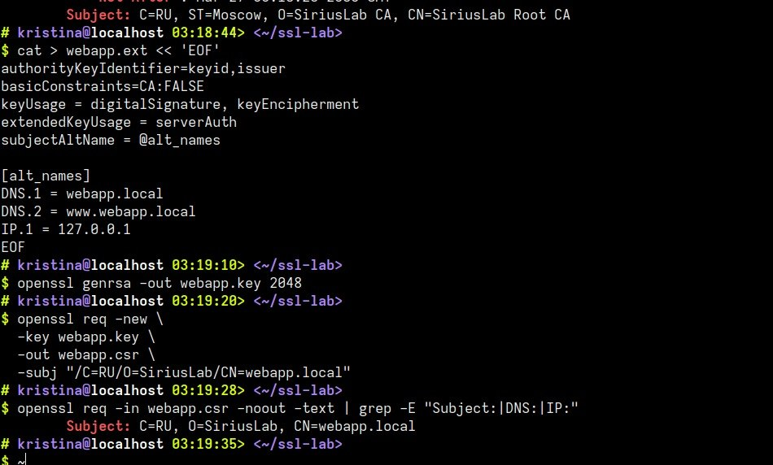

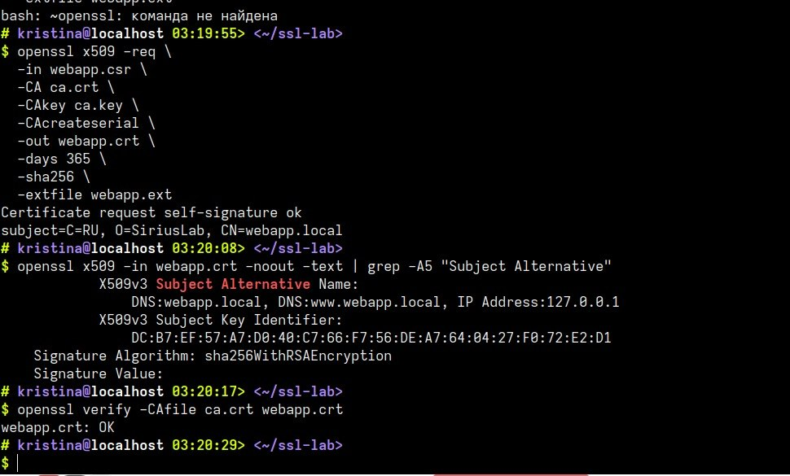

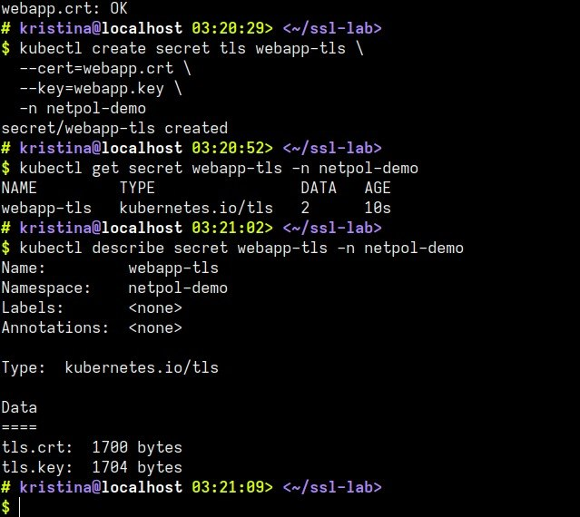

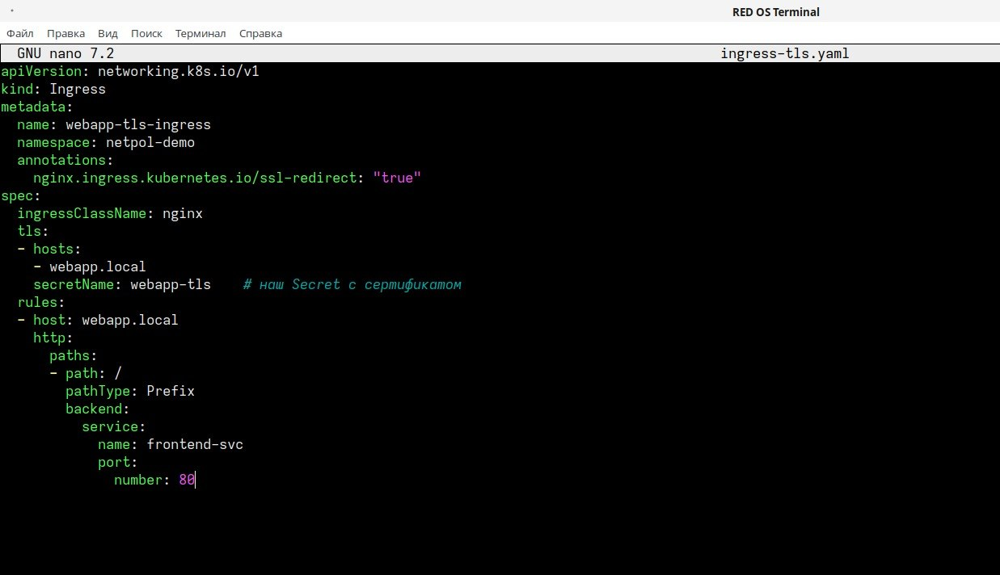

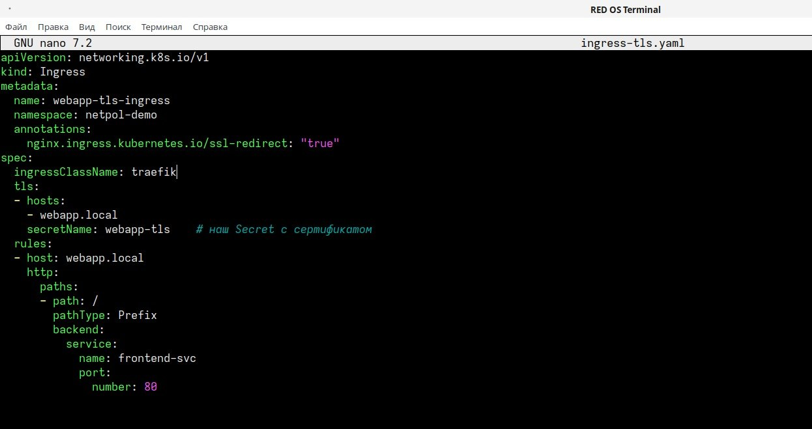

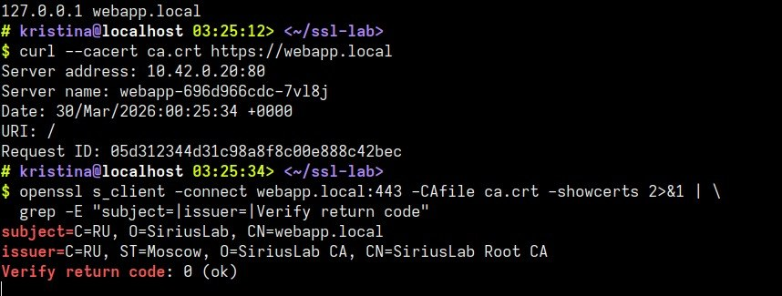

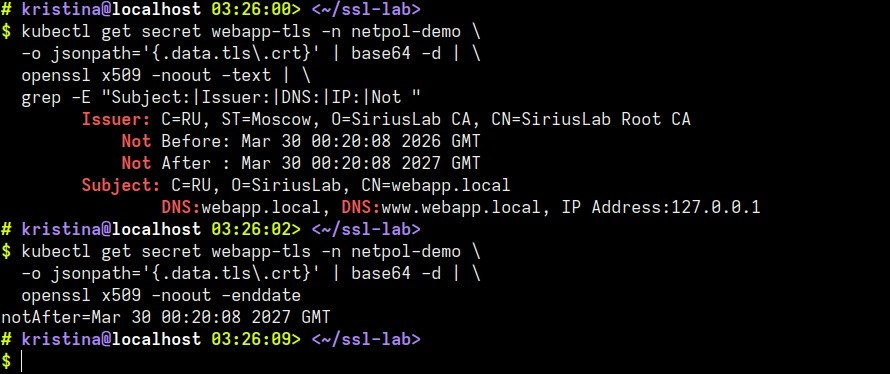