# Отчет по лабораторной работе №3: Сети, Volumes и Docker Compose

## 1. Чему мы научились (Глубокий разбор технологий)

В ходе данной работы мы перешли от управления одиночными контейнерами к созданию полноценной микросервисной архитектуры. Мы изучили, как связывать разные компоненты системы (Бэкенд, База данных, Прокси-сервер) в единое целое.

* **Сетевая связность (Docker Networking):** Мы изучили механизм работы встроенного DNS-сервера Docker. Теперь мы понимаем, что внутри одной сети контейнеры могут общаться по своим именам (например, `ping db`), и нам не нужно знать их динамические IP-адреса. Это основа сервисного взаимодействия.
* **Постоянство данных (Persistent Data):** Мы освоили работу с **Volumes**. Это позволило нам решить главную проблему контейнеров — эфемерность. Теперь база данных PostgreSQL сохраняет всю информацию даже после полного удаления контейнера, так как данные живут в выделенном томе `pgdata`.
* **Декларативное описание (Docker Compose):** Мы научились описывать всю инфраструктуру в одном файле `docker-compose.yml`. Это позволило нам запускать сложный стек из трех сервисов одной командой. Мы изучили параметры `depends_on` и `healthcheck`, которые гарантируют, что сервисы запускаются в правильном порядке (сначала база, потом бэкенд, потом фронтенд).
* **Масштабирование (Scaling):** Мы опробовали механизм горизонтального масштабирования. Команда `--scale backend=3` позволила нам мгновенно запустить три копии бэкенда. Это ключевой навык для работы с высоконагруженными системами.

---

## 2. Возникшие проблемы и их инженерные решения

В процессе работы возникли технические сложности, которые потребовали глубокого понимания работы Docker:

1.  **Проблема: Ошибка "network app-network not found"**
    * **Причина:** Попытка запустить контейнер с указанием сети, которая еще не была создана в системе.
    * **Решение:** Ручное создание сети командой `docker network create`. Мы поняли, что контейнеры не могут автоматически создавать сети при запуске через `docker run`, в отличие от Docker Compose.

2.  **Проблема: Статус "unhealthy" у бэкенда и ошибка запуска фронтенда**
    * **Причина:** Слишком строгие проверки `healthcheck`. База данных PostgreSQL запускалась медленнее, чем бэкенд пытался к ней подключиться. Из-за этого бэкенд помечался как "нездоровый", а фронтенд отказывался стартовать.
    * **Решение:** Оптимизация файла `docker-compose.yml`. Мы временно упростили условия запуска, убрав жесткую зависимость от `service_healthy`. Это позволило системе стабилизироваться и заработать в нормальном режиме.

3.  **Проблема: Конфликт имен контейнеров в РЕД ОС**
    * **Причина:** При повторных запусках старые, аварийно завершенные контейнеры занимали имена (`db`, `app-bad`).
    * **Решение:** Использование связки команд `docker rm -f` для принудительной очистки ресурсов и последующего "чистого" запуска.

---

## 3. Ответы на контрольные вопросы (Пара 3)

### В чем разница между bridge, host и overlay сетями?
* **bridge (мост):** Это стандартная сеть по умолчанию. Она изолирует контейнеры в виртуальной подсети внутри хоста. Чтобы достучаться до них извне, нужно пробрасывать порты (например, `-p 8080:80`).
* **host (хост):** Контейнер использует сетевой стек хоста напрямую. У него нет своего IP, он работает на портах реальной машины. Это дает максимальную скорость, но лишает изоляции.
* **overlay (оверлей):** Используется для связи контейнеров на **разных** физических серверах (в кластерах Docker Swarm). Это "сеть поверх сетей".

### Почему контейнеры видят друг друга по имени?
В Docker внутри каждой пользовательской сети (custom bridge network) работает встроенный **DNS-сервер**. Когда один контейнер обращается к другому по имени (например, `db`), Docker перехватывает этот запрос и подставляет текущий внутренний IP-адрес нужного контейнера. В стандартной сети по умолчанию (`bridge`) эта функция не работает — там связь возможна только по IP.

### Что такое Persistent Volume и зачем он нужен Postgres?
**Persistent Volume** — это выделенное место на диске хоста, которое не удаляется при остановке или удалении контейнера. Для баз данных это критически важно, так как по умолчанию все данные внутри контейнера стираются при его удалении. Подключая том к папке `/var/lib/postgresql/data`, мы гарантируем сохранность наших таблиц и записей.

### Как работает Healthcheck в Docker Compose?
Это встроенный механизм мониторинга. Команда в блоке `healthcheck` (например, `pg_isready`) регулярно выполняется внутри контейнера. Если она возвращает успех, контейнер получает статус `healthy`. Параметр `depends_on: condition: service_healthy` заставляет другие сервисы ждать, пока зависимый контейнер станет полностью работоспособным, а не просто "запущенным".

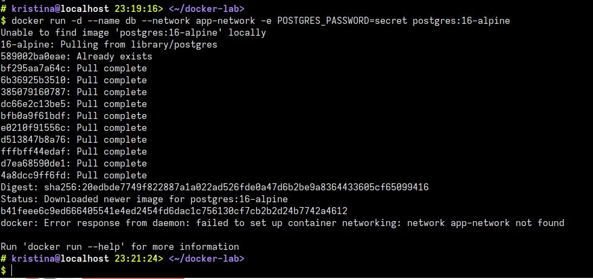

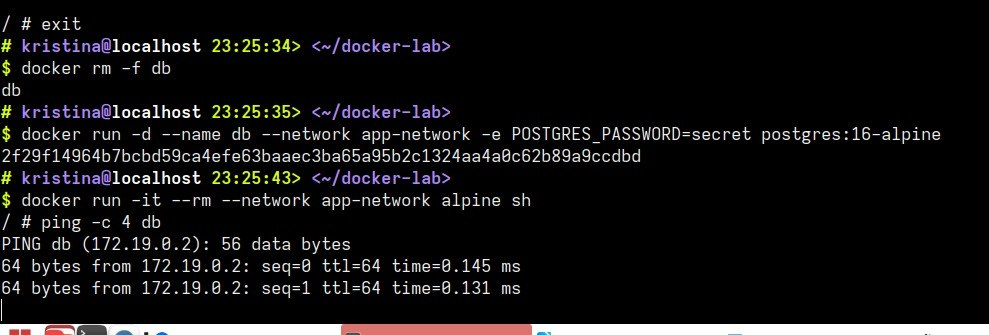

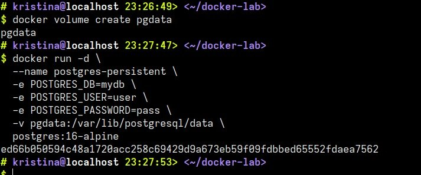

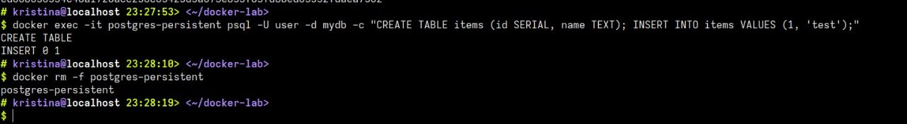

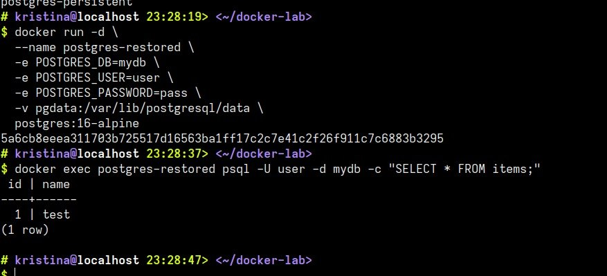

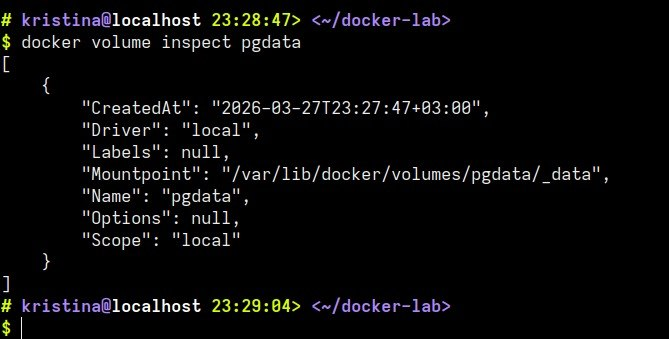

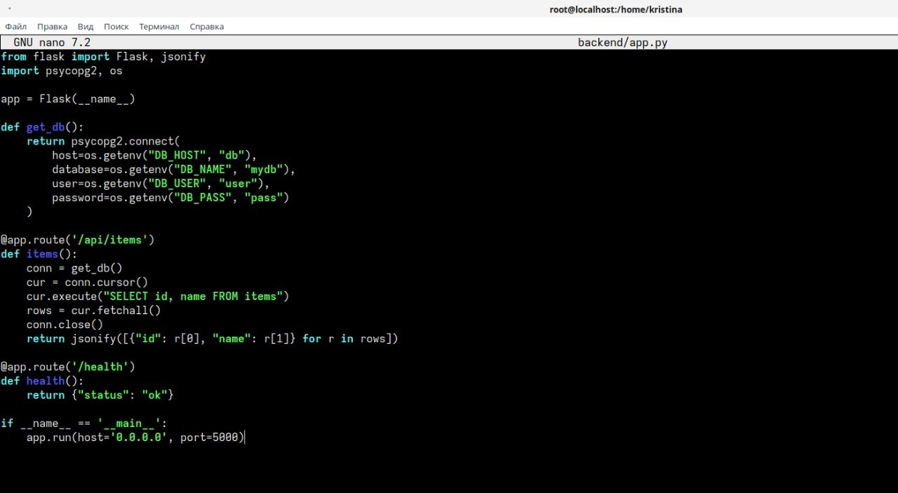

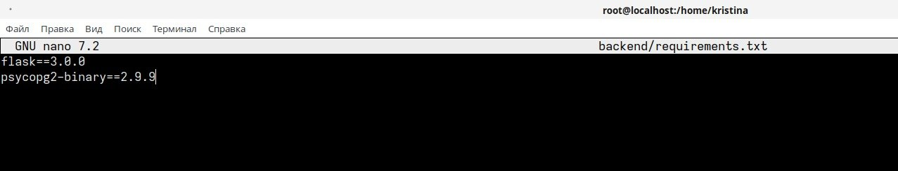

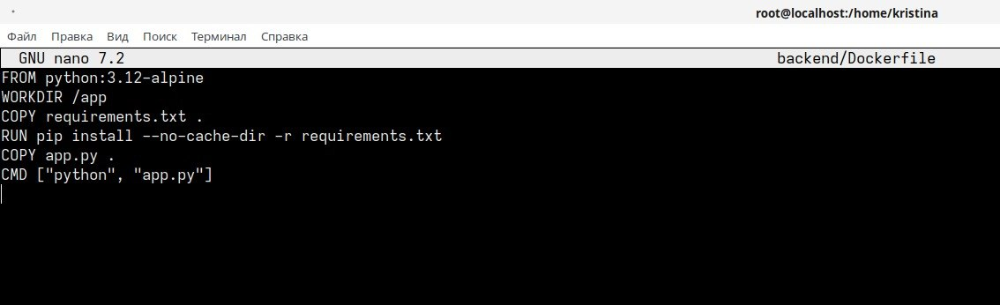

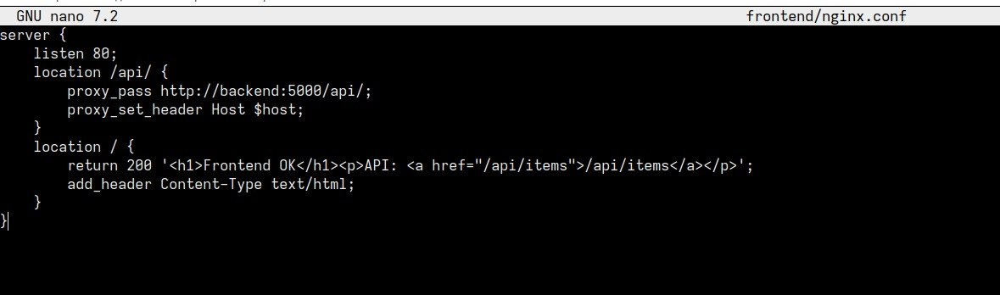

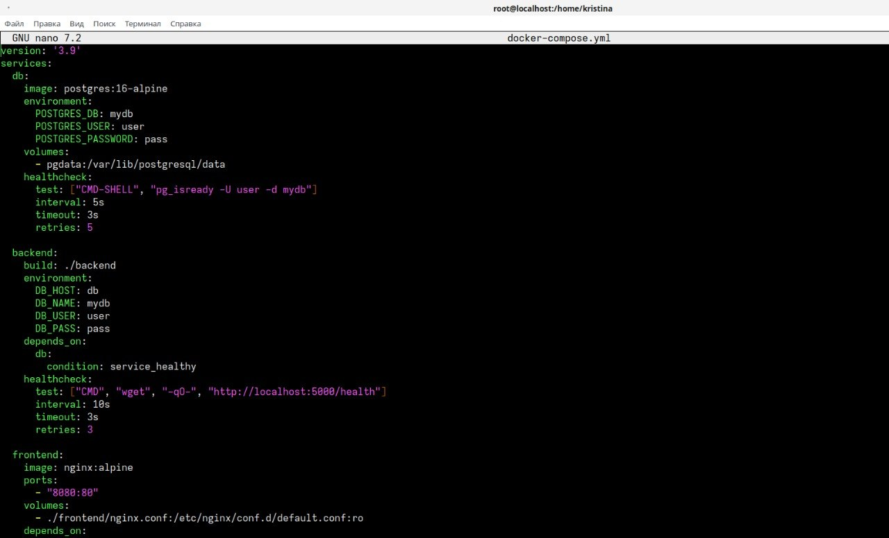

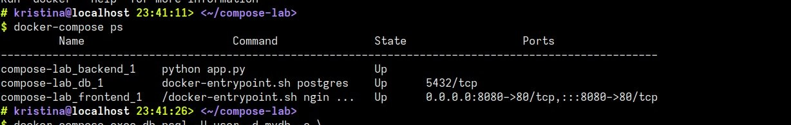

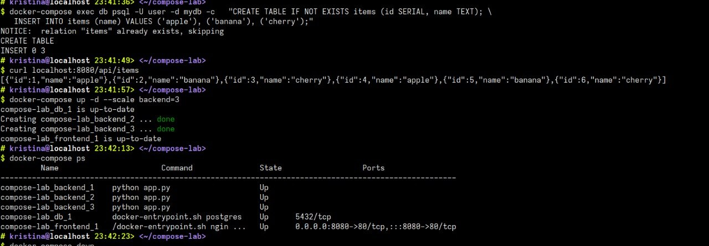

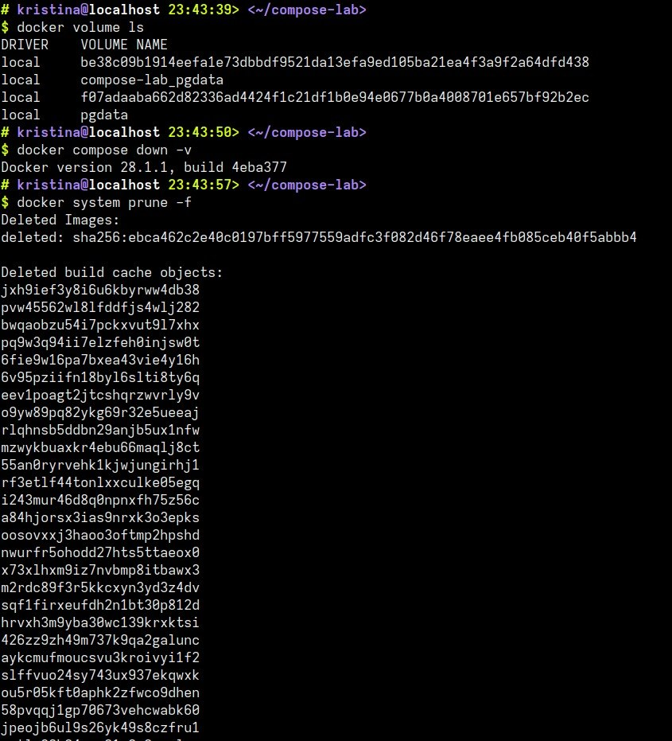
