# 1. Чему научился
В ходе выполнения второй лабораторной работы я углубил свои знания в области контейнеризации. Особое внимание уделил освоению многоэтапной сборки Docker-образов (multistage build), что позволяет значительно уменьшить размер финального образа. На практике изучил, как разделять стадии компиляции и сборки: сначала собираются все зависимости на одном этапе, а затем во финальный образ переносятся только необходимые компоненты, что позволяет избежать лишнего "мусора" в итоговом контейнере.

# 2. Возникшие проблемы и их решения
В процессе выполнения лабораторной работы проблем не возникло. Все этапы сборки прошли успешно, и я смог корректно реализовать многоэтапную сборку, добившись значительного уменьшения размера финального образа. Также удалось без затруднений настроить ограничения ресурсов для контейнера.

# 3. Ответы на контрольные вопросы
Почему образ такой большой? Неоптимизированный образ имеет большой размер из-за использования тяжелого базового образа python:3.12, включающего в себя компиляторы, системные утилиты и различные кэши. В результате "плохой" образ может занимать около 1 ГБ, тогда как оптимизированный образ (благодаря многоэтапной сборке и использованию легковесных базовых образов) становится в несколько раз меньше, оставляя только необходимый рантайм приложения (примерно 130-150 МБ).

Как работают ограничения ресурсов? Лимиты ресурсов функционируют корректно. При мониторинге через docker stats можно наблюдать, что контейнер строго ограничен 0.5 CPU и 128 MB RAM, как и было задумано.

Преимущества многоэтапной сборки: Позволяет разделить процесс сборки на несколько этапов, где на первом этапе происходит компиляция и установка зависимостей, а во финальный образ переносятся только необходимые файлы и бинарники, что значительно уменьшает размер образа и повышает безопасность.

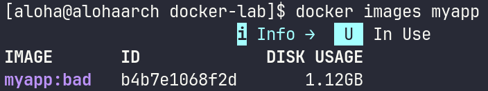

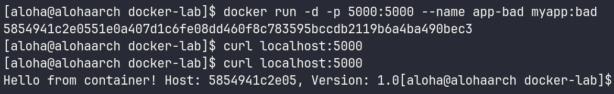

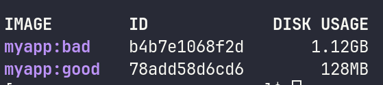

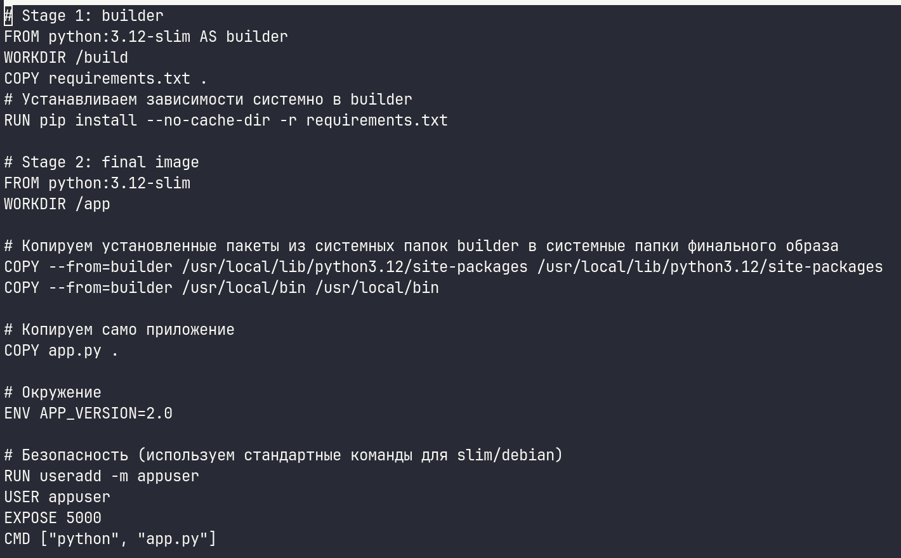

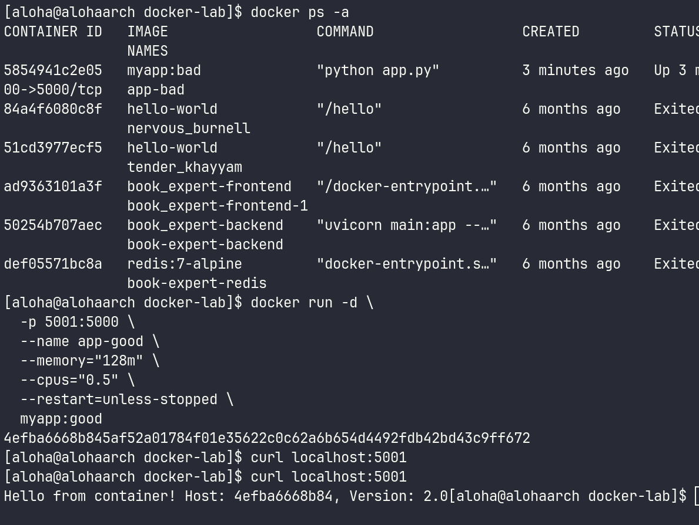

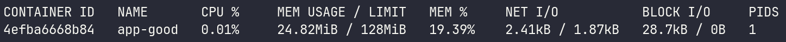

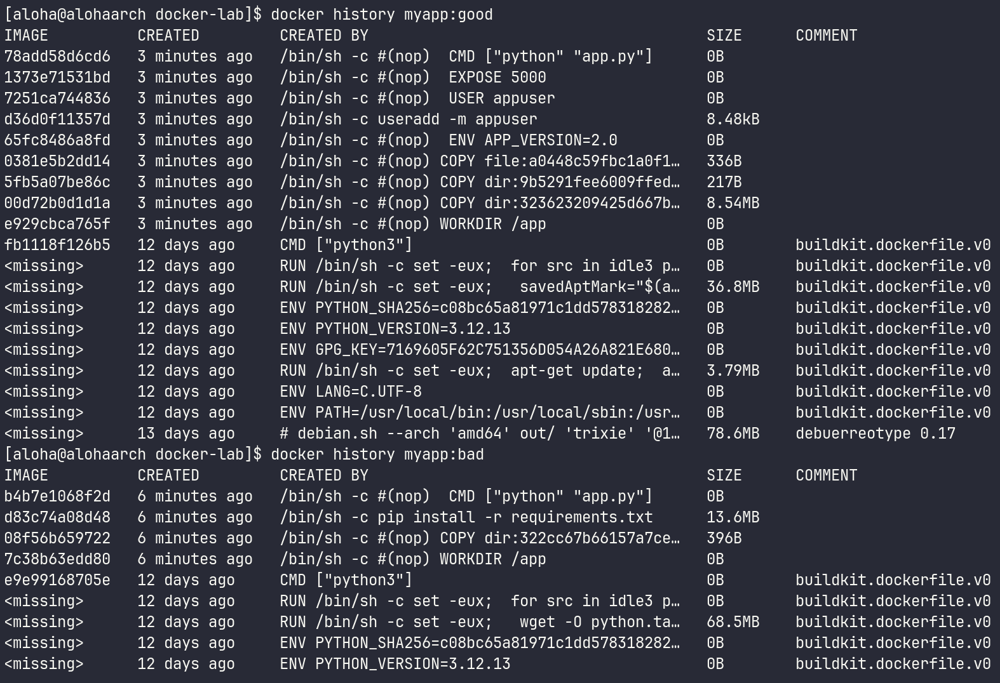

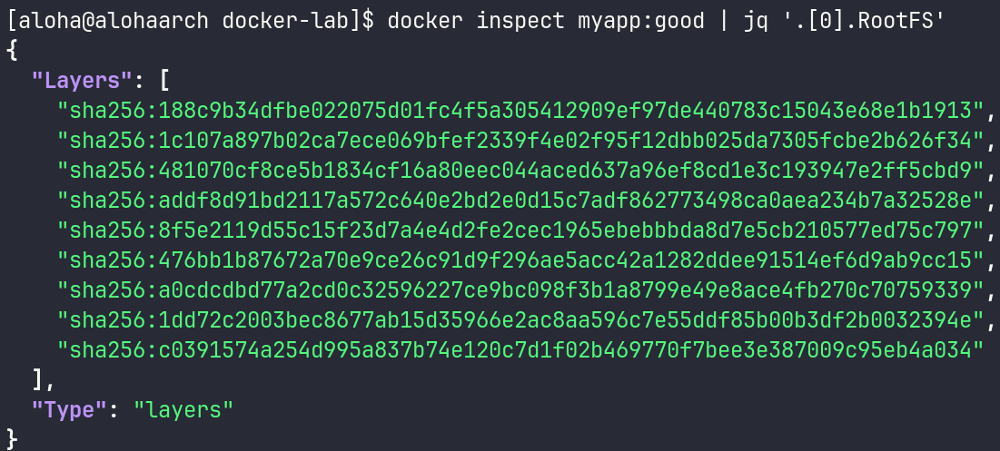

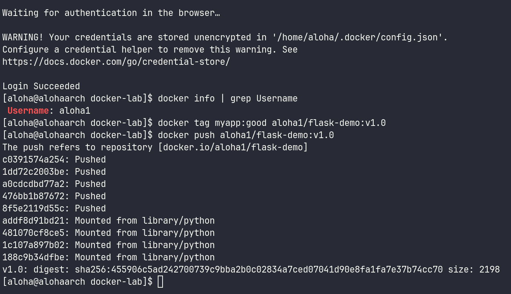

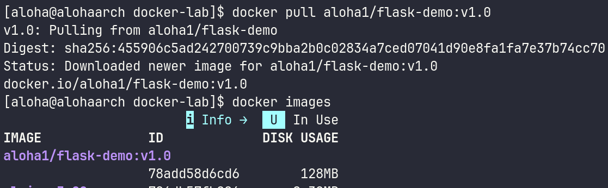

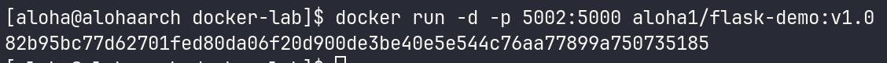