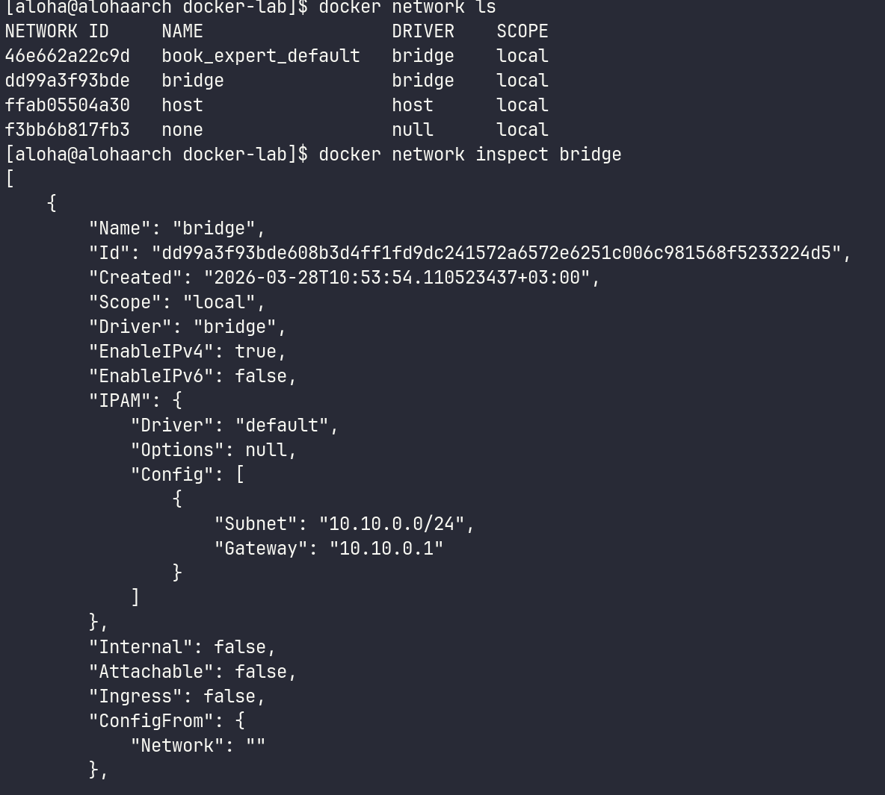
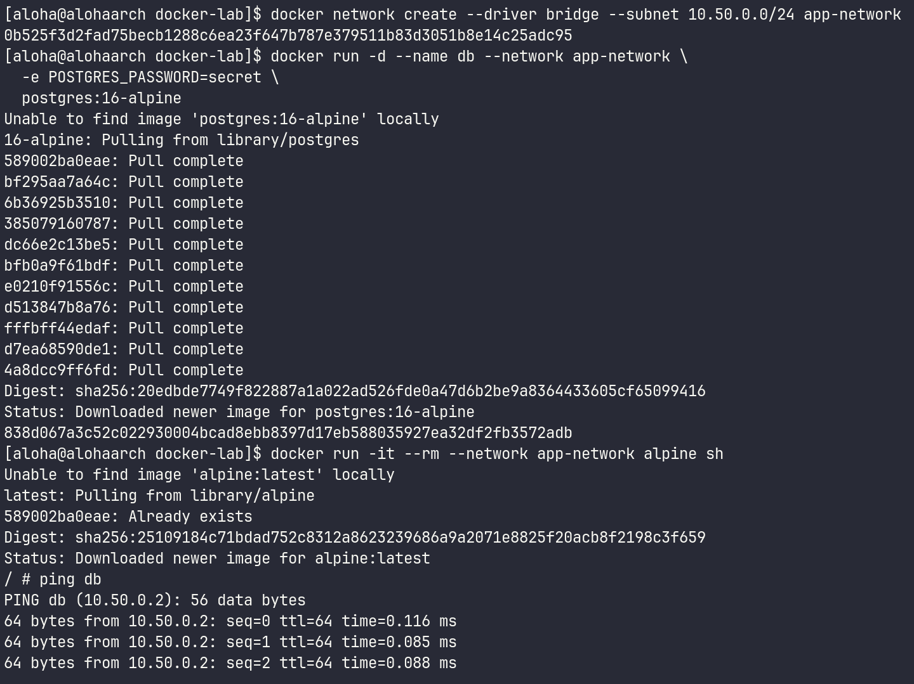
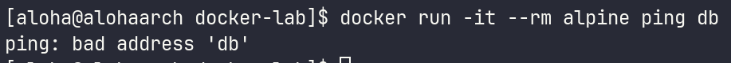
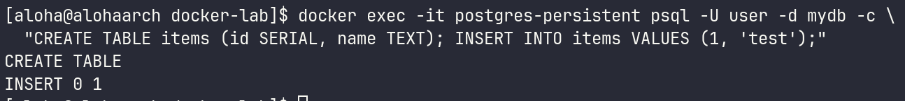
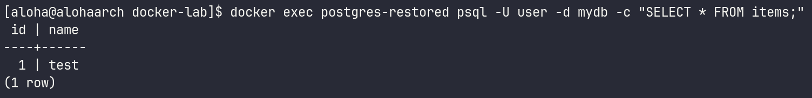
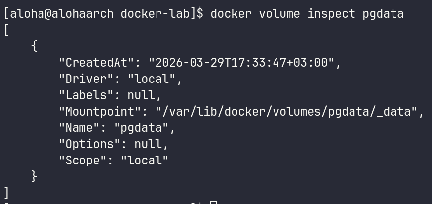
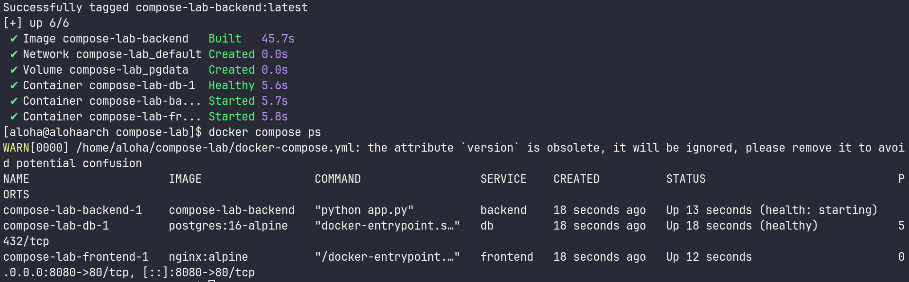
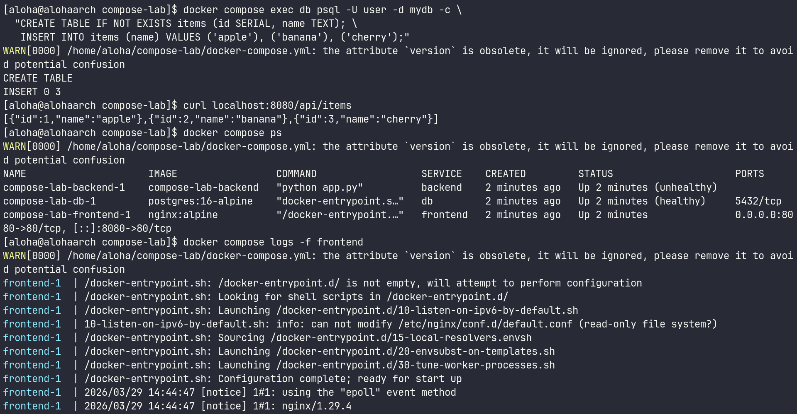
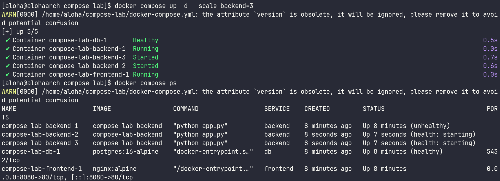
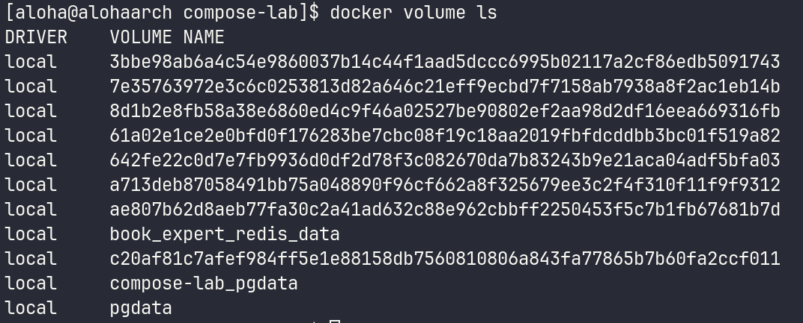

# 1. Чему научился
В ходе третьей лабораторной работы я освоил оркестрацию многоконтейнерных приложений с помощью Docker Compose. На практике поработал с комплексной связкой: Frontend (Nginx), Backend (Flask) и DB (Postgres). Также изучил работу с persistent volumes для сохранения данных и настройку healthchecks для контроля готовности сервисов. Закрепил навыки управления сетями и динамического масштабирования сервисов (--scale backend=3) для равномерного распределения нагрузки между экземплярами приложения.

# 2. Возникшие проблемы и их решения
В процессе выполнения лабораторной работы столкнулся с одной досадной проблемой: я вафля не мог запустить docker-compose.yml, потому что не поставил пробел и получал ошибку yaml: line 14, column 15: mapping values are not allowed in this context. После внимательного изучения синтаксиса YAML и проверки отступов, проблема была успешно решена. Также были небольшие сложности с настройкой взаимодействия между сервисами, но в итоге все сервисы были корректно связаны.

# 3. Ответы на контрольные вопросы
Разница типов сетей в Docker: 
* Bridge: Виртуальная сеть внутри одного хоста (стандартный тип для Compose). Контейнеры изолированы, но могут взаимодействовать друг с другом по внутренним именам.
* Host: Контейнер использует сетевой стек хоста напрямую (отсутствует изоляция портов, но обеспечивается более высокая производительность).
* Overlay: Используется для связи контейнеров на разных физических хостах (в Docker Swarm или кластерных конфигурациях).

Итог проверки: Все сервисы перешли в статус healthy, данные из базы успешно отдаются через Nginx (curl localhost:8080/api/items), а команда масштабирования корректно подняла 3 экземпляра бекенда.

Преимущества использования Docker Compose: Позволяет описывать и запускать многоконтейнерные приложения с помощью одного YAML-файла, упрощает управление зависимостями между сервисами и настройку сетевого взаимодействия.

