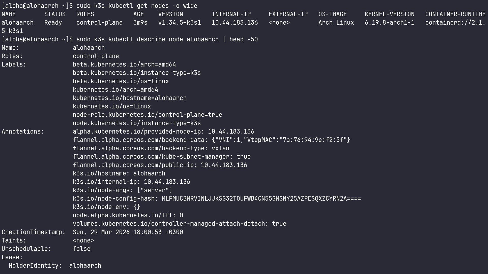
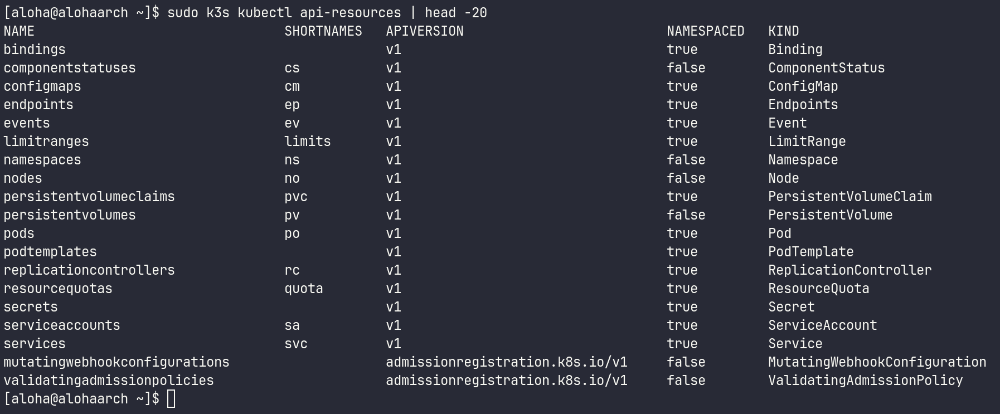
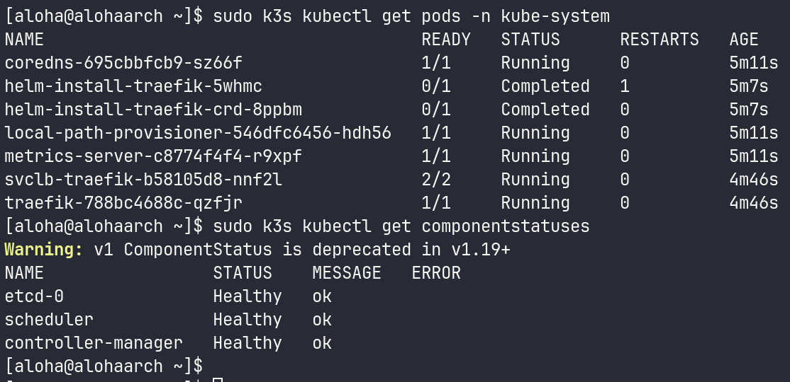
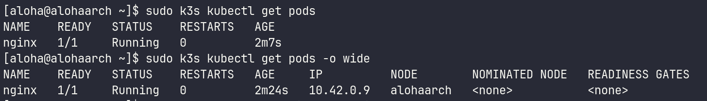
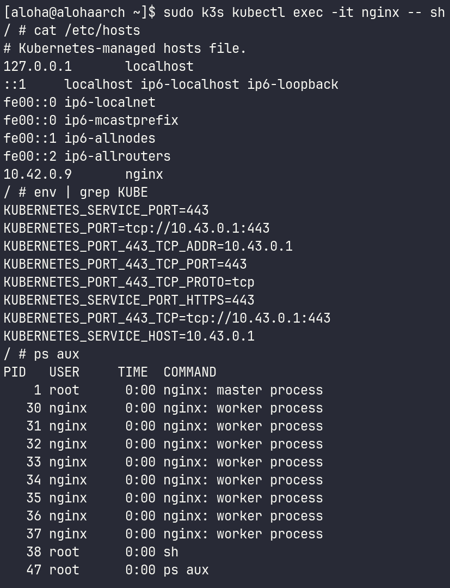
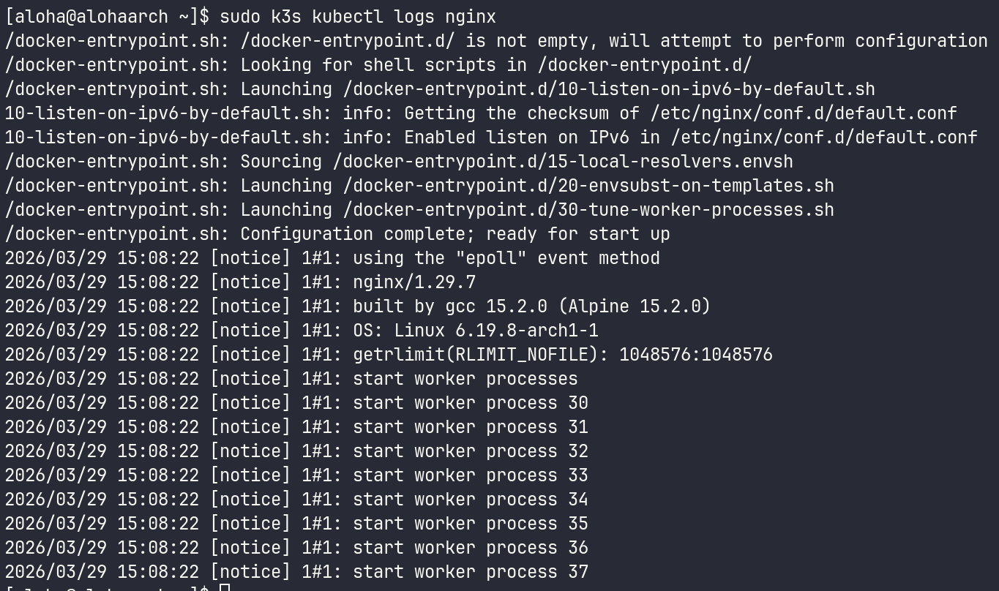
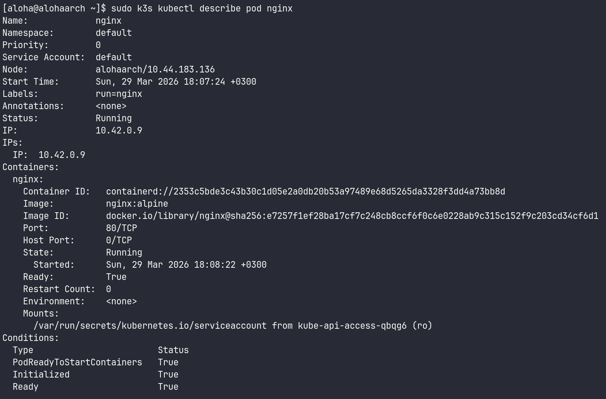
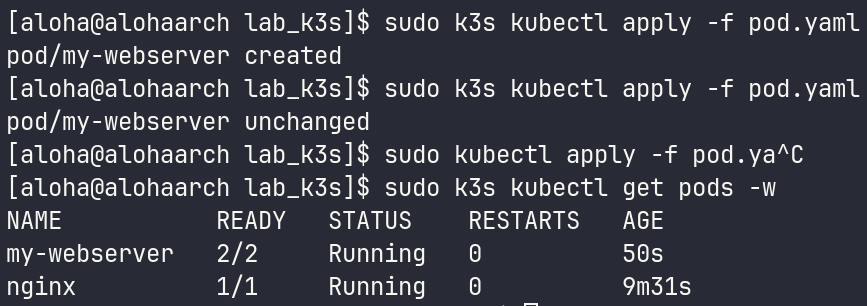
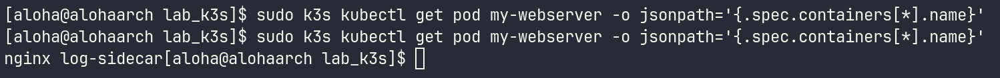
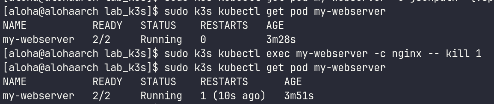

# 1. Чему научился
В ходе четвертой лабораторной работы я освоил диагностику кластера, научился проверять статус нод (Ready) и состояние системных компонентов через kubectl get nodes и kubectl get cs. Работал с Control Plane, изучил состав системного пространства имен kube-system, а также расположение манифестов статических подов. Практиковал управление жизненным циклом Pod, применяя как императивный метод (kubectl run), так и декларативный (через YAML-манифесты). Также изучил инспекцию ресурсов: просмотр логов, вход в контейнеры через exec, анализ сетевого окружения и переменных среды. Применил sidecar-паттерн, запуская несколько контейнеров в одном поде с общим томом для логирования.

# 2. Возникшие проблемы и их решения
В процессе выполнения лабораторной работы технических проблем и ошибок не возникло. Для установки и тестирования кластера я использовал k3s - легковесную реализацию Kubernetes, что позволило быстро развернуть окружение. Кластер и объекты развернулись в штатном режиме, согласно методическим указаниям.

# 3. Контрольные вопросы
Pod — это минимальная единица развертывания в Kubernetes, которая может содержать один или несколько контейнеров, разделяющих общие сетевые ресурсы и хранилища. Container — это конкретный изолированный процесс (например, Docker), запущенный внутри пода и выполняющий код приложения.

Какие поды в kube-system всегда должны быть Running?
Для корректной работы кластера в статусе Running должны находиться основные компоненты Control Plane:

kube-apiserver — точка входа для всех запросов.

etcd — база данных кластера.

kube-scheduler — отвечает за назначение подов на ноды.

kube-controller-manager — следит за состоянием ресурсов.

kube-proxy — обеспечивает сетевую связность.

DNS-сервис (например, coredns) — для работы имен внутри кластера.

Почему Pod не удалился, а перезапустился? Кто за это отвечает?
Pod не удалился, потому что Kubernetes следит за «желаемым состоянием» (Desired State). За перезапуск контейнеров внутри пода отвечает агент kubelet, который запущен на каждой ноде. Если основной процесс контейнера завершается с ошибкой или принудительно убивается, kubelet видит несоответствие текущего состояния заданному и перезапускает контейнер согласно политике restartPolicy (по умолчанию Always).

