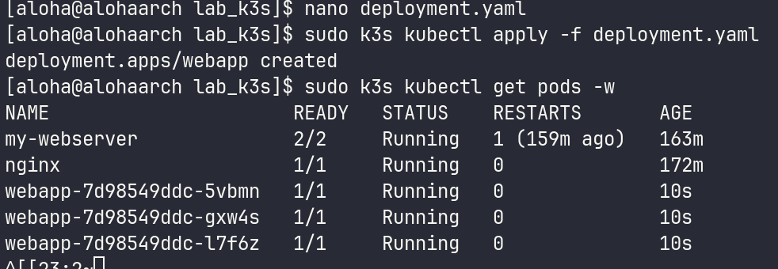
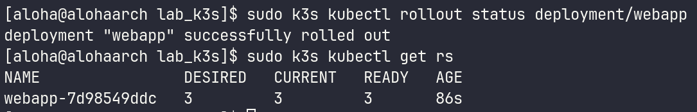
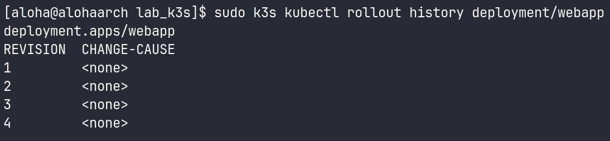
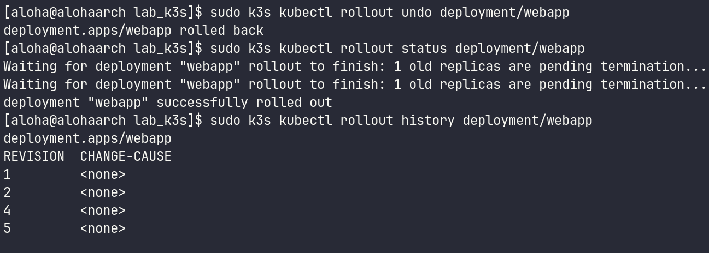
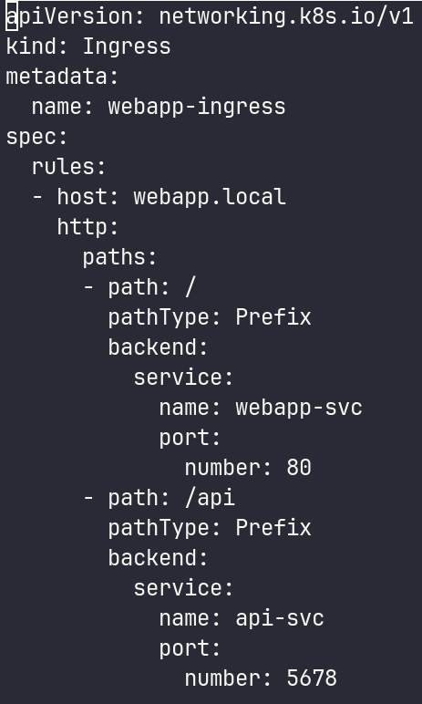
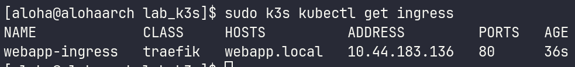
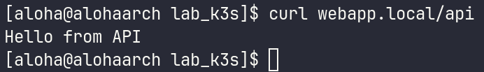
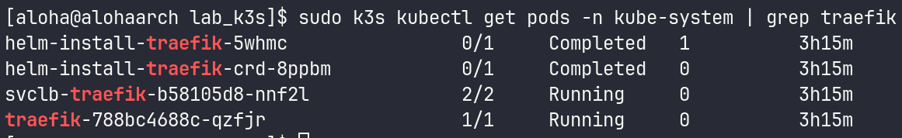
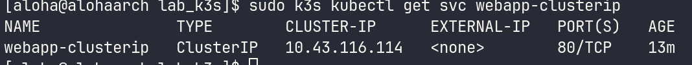

# 1. Чему научился
В ходе пятой лабораторной работы я освоил развертывание отказоустойчивых приложений через Deployment и выполнение обновлений без даунтайма (Rolling Update) с возможностью отката версий. Успешно создал сервисы типов ClusterIP и NodePort для организации доступа к подам. Также закрепил на практике настройку Ingress-контроллера с правилами (rules) для маршрутизации трафика по разным путям (/ на frontend и /api на backend). Работал с k3s, что позволило эффективно настроить и протестировать все компоненты кластера.

# 2. Возникшие проблемы и их решения
В процессе выполнения лабораторной работы возникли некоторые специфические проблемы, связанные с использованием k3s:

Ошибка с доступом к конфигурационному файлу: При работе с k3s возникли трудности с доступом к k3s.yaml. Проблема была решена копированием системного конфига в ~/.kube/config и настройкой прав доступа для текущего пользователя.

Проблемы с сетевыми настройками: Встроенный фаервол операционной системы мог блокировать внутреннюю сеть контейнеров k3s. Это решалось добавлением необходимых интерфейсов в доверенную зону и настройкой соответствующих правил.

# 3. Контрольные вопросы
Разница между ClusterIP, NodePort и LoadBalancer:

ClusterIP: Делает сервис доступным только внутри кластера. Используется для внутренних компонентов (например, базы данных), к которым не должно быть доступа извне.

NodePort: Открывает статический порт (обычно 30000–32767) на каждом физическом узле (ноде) кластера. Позволяет достучаться до приложения извне по IP ноды и этому порту. Является надстройкой над ClusterIP.

LoadBalancer: Используется в облачных средах (AWS, Yandex Cloud и т.д.). Автоматически создает внешний облачный балансировщик, который выдает публичный IP-адрес и распределяет трафик по нодам. Является надстройкой над NodePort.

Deployment vs ReplicaSet: Deployment предоставляет декларативный способ управления состоянием подов и ReplicaSets, включая возможности обновления и отката. ReplicaSet же просто обеспечивает поддержание заданного количества реплик подов.

