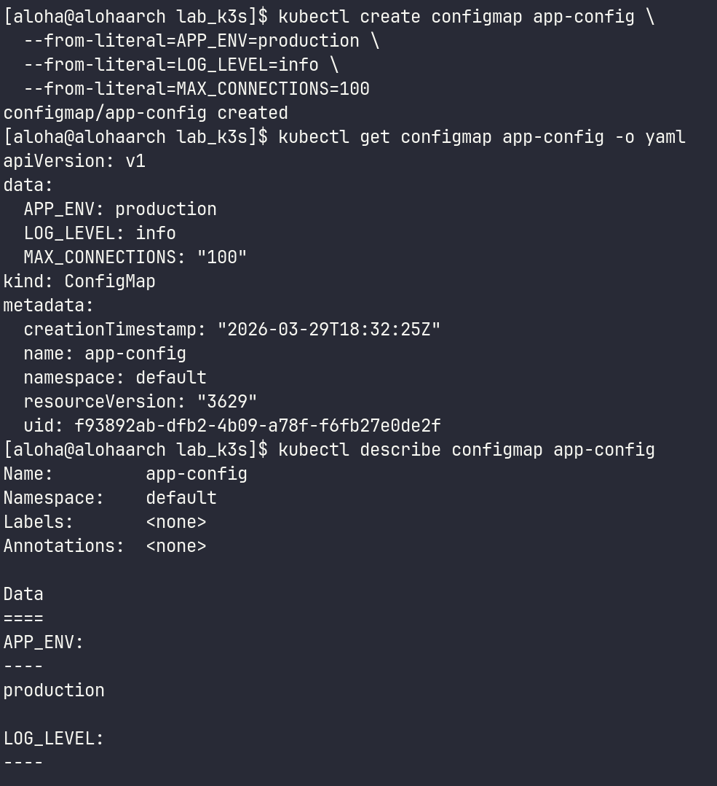
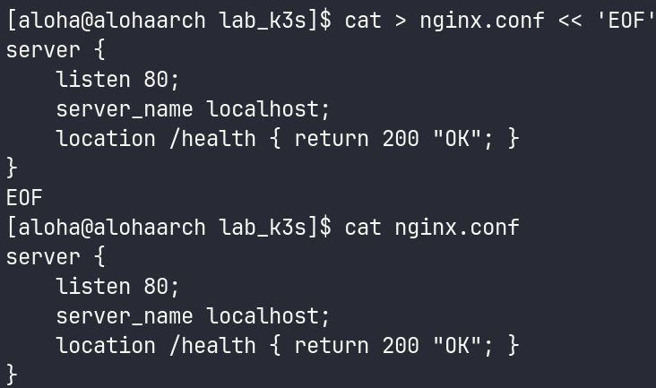
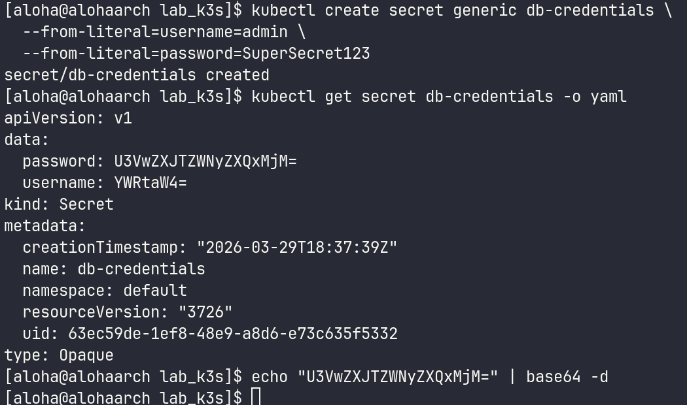
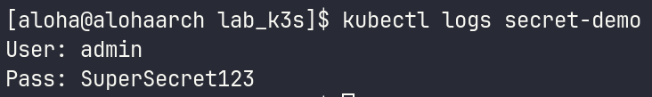
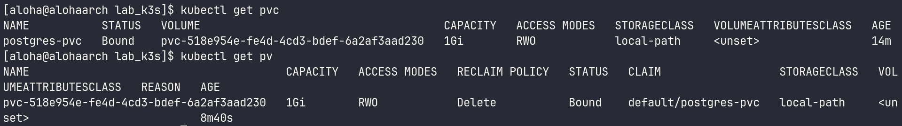
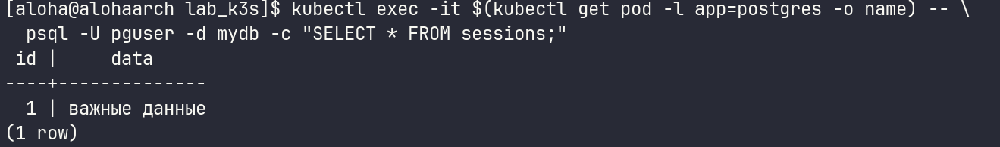
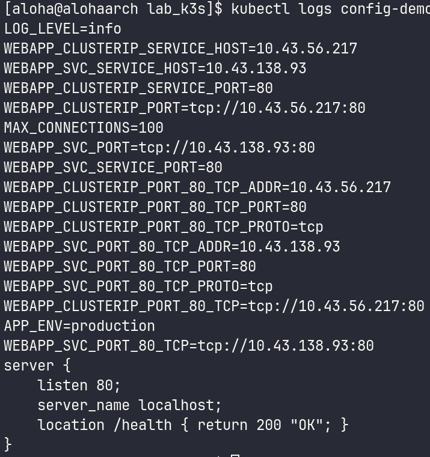

# 1. Чему научился
В ходе шестой лабораторной работы я освоил управление конфигурацией в Kubernetes. На практике изучил, как создавать ConfigMap и передавать его в Pod тремя способами: как переменные окружения (env), массово через envFrom и в виде монтируемых файлов. Также научился разворачивать PostgreSQL с использованием PersistentVolumeClaim (PVC) и понял, как обеспечивается персистентность данных. Убедился на практике, что данные сохраняются даже после полного удаления Пода, так как жизненный цикл PVC не зависит от цикла Пода. Кроме того, изучил механизм работы Secret и способы их подключения к приложению.

# 2. Возникшие проблемы и их решения
В процессе выполнения лабораторной работы возникли некоторые технические сложности:

Проблема с PVC: В начале работы столкнулся с тем, что PVC находился в статусе Pending. Причина заключалась в том, что в манифесте был указан storageClassName, который отсутствовал в используемом кластере. Проблема была решена после диагностики через kubectl describe pvc и замены на доступный StorageClass.

Проблема с доступом к поду: Также была ситуация, когда возникала ошибка при попытке выполнить kubectl exec до того, как Под перешел в статус Running. Под оставался в состоянии Pending из-за не привязанного PVC. Решением стало пересоздание PVC с правильным StorageClass и ожидание статуса Bound и перехода Пода в Running.

# 3. Контрольные вопросы
Почему Secret небезопасен по умолчанию и что делать?

По умолчанию Kubernetes хранит секреты в etcd в виде обычного текста (plain text). То, что мы видим в YAML-выводе — это всего лишь кодировка Base64, которая не является шифрованием и легко декодируется. Любой, кто имеет доступ к API Kubernetes или базе etcd, может прочитать пароли и чувствительные данные.

Для повышения безопасности рекомендуется:

Включить Encryption at Rest (шифрование в etcd) через EncryptionConfiguration.
Использовать внешние хранилища секретов, такие как HashiCorp Vault, AWS Secrets Manager или Azure Key Vault.
Строго ограничивать доступ к секретам через RBAC (Role-Based Access Control).

Разница между ConfigMap и Secret: ConfigMap используется для хранения незашифрованных конфигурационных данных, в то время как Secret предназначен для хранения чувствительной информации, хотя по умолчанию также не зашифрован.

