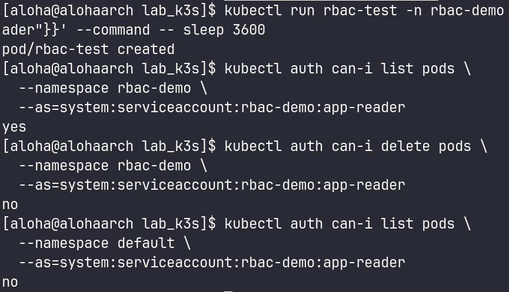
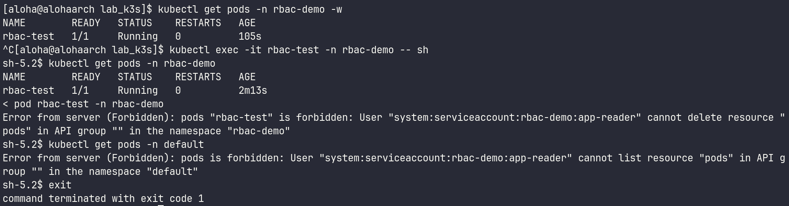
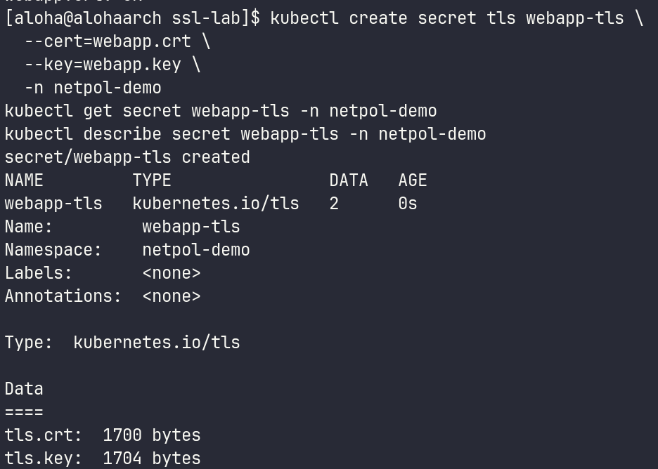
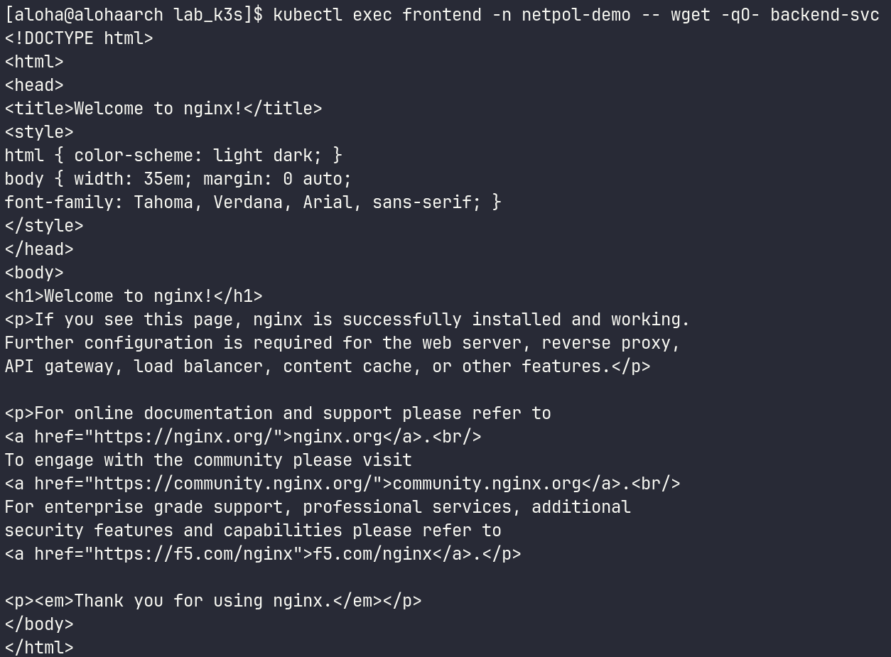
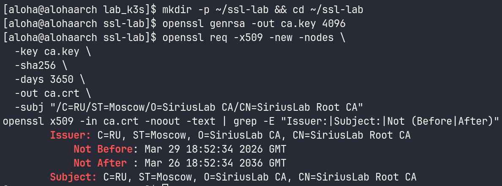
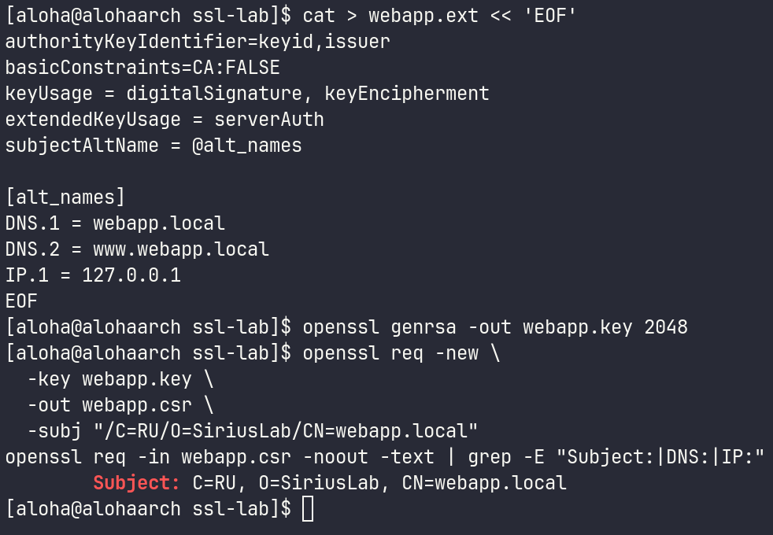
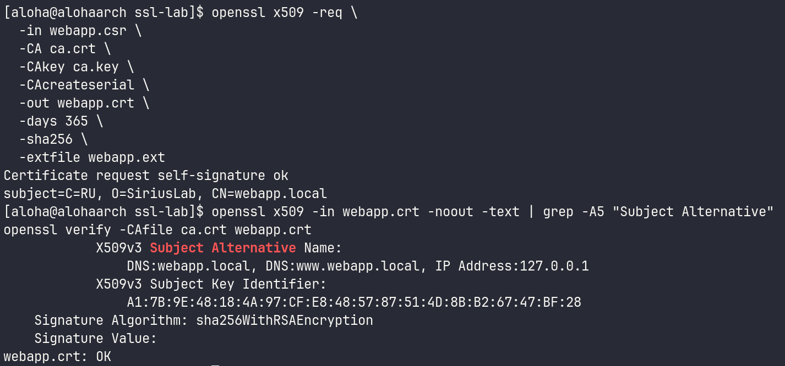
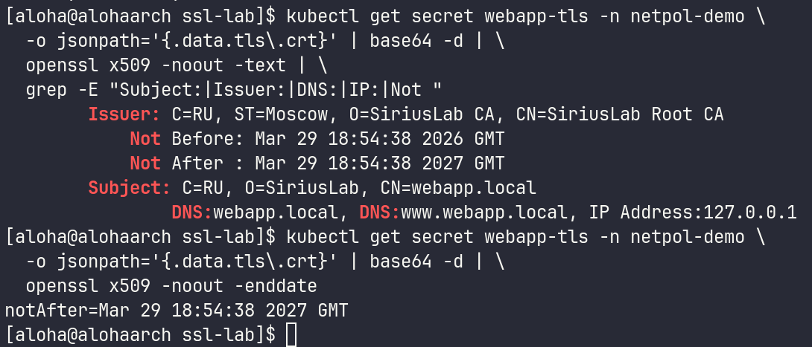
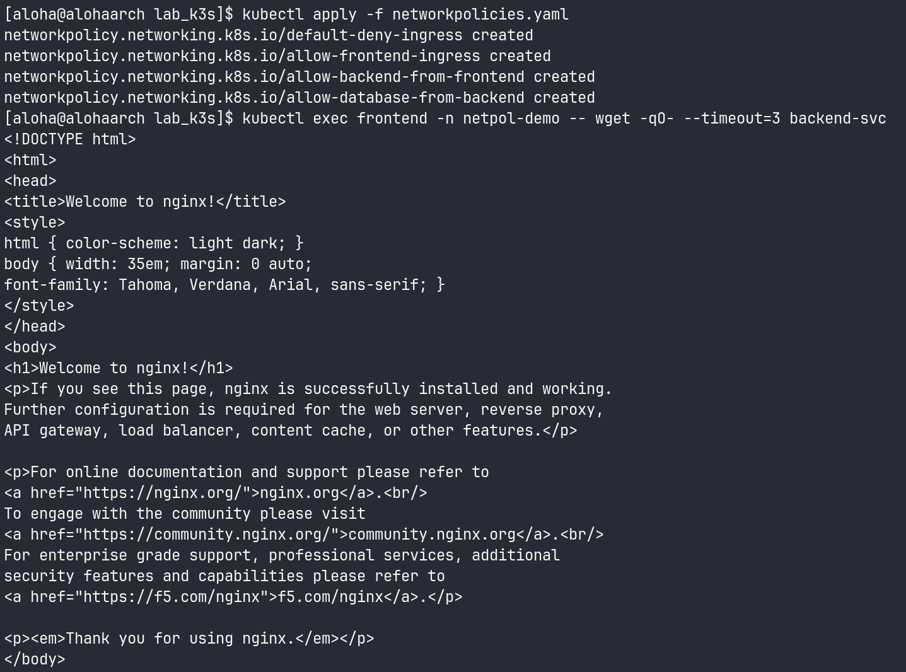
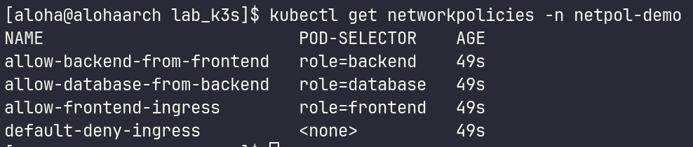

# 1. Чему научился
В ходе седьмой лабораторной работы я освоил важнейшие аспекты безопасности в Kubernetes. Реализовал принцип минимальных привилегий (RBAC), научившись разграничивать доступ через создание ServiceAccount, Role и RoleBinding. Понял, как настроить приложение так, чтобы оно могло только «смотреть» на поды, но не могло их «трогать». Также изучил микросегментацию сети (NetworkPolicy) и подход Zero Trust, научившись изолировать неймспейс с помощью default-deny-all и точечно разрешать только легитимные сетевые связи. Освоил управление криптографией и TLS, пройдя полный цикл работы с сертификатами — от создания собственного удостоверяющего центра (CA) до настройки TLS-терминации на уровне Ingress-контроллера. Также развил навыки диагностики и Troubleshooting.

# 2. Возникшие проблемы и их решения
В процессе выполнения лабораторной работы возникли некоторые сложности:

Проблема с запуском проверочного пода: На этапе запуска проверочного пода rbac-test возникла ситуация, когда при попытке войти в контейнер через kubectl exec система выдавала ошибку о том, что контейнер не найден. Анализ состояния пода показал, что он находился в статусе ContainerCreating, так как узел не успел выкачать образ. Проблема была решена путем ожидания перехода пода в состояние Running.

Проблема с NetworkPolicy: При настройке NetworkPolicy трафик между frontend и database продолжал проходить, хотя должен был блокироваться. Причина оказалась в том, что манифест был сохранен, но не применен в кластер. После выполнения kubectl apply -f networkpolicies.yaml сетевой экран заработал корректно.

Проблема с Ingress TLS: После настройки Ingress-ресурса возникли проблемы с самоподписанным сертификатом. Оказалось, что в кластере работает контроллер Traefik, а не Nginx, как предполагалось в манифесте. Решением стало удаление привязки к конкретному классу, что позволило контроллеру подхватить сертификат.

# 3. Контрольные вопросы
В чем разница между Role и ClusterRole?
Role действует только внутри одного конкретного неймспейса, тогда как ClusterRole дает права на уровне всего кластера (например, на просмотр всех узлов или подов во всех неймспейсах сразу).

Что произойдет, если мы применим NetworkPolicy в кластере, где установлен сетевой плагин Flannel?
kubectl примет манифест и не выдаст ошибок, но блокировка работать не будет. Flannel не умеет фильтровать трафик. Для работы политик нужны Calico, Cilium или Weave Net.

Зачем нам файл webapp.ext при создании сертификата?
Там прописаны SAN (Subject Alternative Names). Современные браузеры и утилита curl больше не доверяют сертификатам только по полю Common Name (CN). Им нужно, чтобы домен (например, webapp.local) был явно указан в расширении SAN.

Принципы безопасности в Kubernetes: RBAC, Network Policies и TLS обеспечивают комплексную защиту кластера на разных уровнях - от управления доступом до шифрования сетевого трафика.

